# ETA: A New Agentic Paradigm for Embodied Tasks

Yitong Chen1,2,∗, Zezheng Huai1,3,∗, Sixian Li1,2,∗, Yubang Wang1,2,∗, Haozhe Zhang1,5,∗ Yifei Zhang1,4,∗, Hechang Chen1,3,† Jingjing Gong1,†, Yu-Gang Jiang2,†,Xipeng Qiu1,2,†

1Shanghai Innovation Institute 2Fudan University 3Jilin University 4Nanjing University 5Zhejiang University

## Abstract

When will robots have their ChatGPT moment? Such a breakthrough requires a general-purpose robot that can handle unfamiliar tasks in unfamiliar environments, remain controllable over long interactions, and learn from experience.

Today’s embodied systems largely follow an end-to-end observation-to-action path. Despite rapid progress, they remain far from this goal: their generalization depends heavily on the coverage of robot training data, while long task execution remains dificult to control and inspect. To realize this goal, we introduce the Embodied Task Agent (ETA), a new paradigm for extending digital agents into the physical world, and release OpenETA as its open-source implementation. ETA centers the robot around a Planner that chooses one Tool call at a time, an Interface that controls execution, and a World that returns the result and a fresh observation. This loop allows the agent to verify outcomes, adapt its plan, and turn successful and failed interactions into reusable experience. OpenETA provides replaceable Planners, composable Tools and Skills, auditable memory, replayable trajectories, and common interfaces for simulation and real robots. For Codex, OpenETA can operate as a lightweight plugin that exposes only observe, mark\_point, and move\_to.

Without using a VLA or task-specific policy as a Tool, OpenETA with gpt-5.6-Sol reaches PASS@5 of 117/130 (90.0%) on 130 LIBERO tasks. Sol already solves 92/130 tasks on the first seed. These results ofer a practical step toward general, controllable, and self-improving physical agents.

“We are on the eve of the largest robotics distribution in history. By Saturday, there’ll be one robot to every five humans.”

— I, Robot (2004)

GitHub: https://github.com/OpenMOSS/OpenETA Project Page: https://openmoss.ai/OpenETA/

## 1 Introduction

Recent large language models have moved beyond text generation, showing broad abilities in reasoning, planning, tool use, and error correction. Coding agents make this emergence concrete. They can decompose high-level goals, navigate complex digital environments, execute actions, evaluate results, recover from failures, and preserve successful proce dures as reusable experience [1–3]. Coding agents are now being applied across software engineering, data analysis, scientific research, automated experimentation, and model design and optimization, with a growing ability to conduct long workflows and improve their own strategies through execution feedback [4, 5]. Together, these developments point toward a general digital agent that solves diverse tasks through execution, feedback, and accumulated experience.

This emergence suggests a practical picture of embodied intelligence’s ChatGPT moment. We define such a system through three core capabilities. First, generality: the same system should understand new tasks and reuse or compose perception, planning, and control capabilities across objects, environments, and embodiments, rather than require a separate policy for every task. Second, controllability: it should maintain explicit task state over long horizons, expose each physical action through a bounded interface, and use actual execution results to determine what happens next. Third, self-improvement: it should turn successful and failed interactions into reusable memory and Skills, while validating each update before it changes future behavior. These are properties of the whole agent system, in which models provide capabilities and the agent composes, monitors, and improves them over time.

However, embodied intelligence today still focuses mainly on end-to-end observation-to-action learning. Vision– language–action models (VLAs) map visual observations and instructions to robot actions [6, 7], while world action models (WAMs) also predict possible future states and actions [8]. Despite rapid progress, their generalization depends heavily on the coverage of robot training data, and behavior over long tasks remains dificult to control and inspect [9]. To move toward the vision above, we introduce the Embodied Task Agent (ETA), a new paradigm for extending digital agents into the physical world, and release OpenETA as its open-source implementation. ETA adds a task-level Planner above specialized models and Tools. As Figure 1 shows, the Planner chooses one Tool call, the Interface controls its execution, and the World returns the result and a fresh observation before the next decision. OpenETA makes this design open and extensible through composable Tools and Skills, replaceable Planners, simulation and robot backends, auditable memory, and replayable trajectories. OpenETA can also operate as a lightweight plugin for Codex that uses only observe, mark\_point, and move\_to.

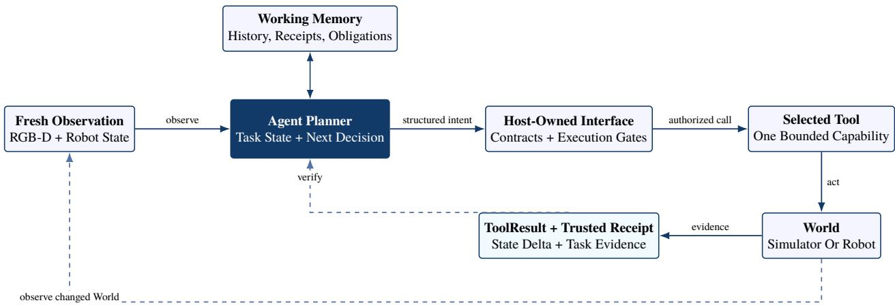  
Figure 1 Planner-centered information flow in OpenETA. The Planner chooses each task-level step, the Interface checks and executes the Tool call, and the World returns evidence and a fresh observation before the next decision.

## Contributions

• A new agentic paradigm for embodied tasks. ETA places a Planner at the center of the physical task loop. The Planner can issue only one world-changing Tool call before it must receive a fresh observation and decide again.

• An open-source framework. OpenETA implements ETA with modular Planners, Tools, memory, and simulationto-robot interfaces. Its execution records make each run easy to inspect and replay. We release OpenETA with both a broad Tool registry and a lightweight three-Tool plugin for Codex.

• Simulation results and deployment resources. Without using a VLA or task-specific policy as a Tool, OpenETA is evaluated with gpt-5.6-Luna, gpt-5.6-Terra, and gpt-5.6-Sol with medium reasoning efort. At PASS@5, they solve 62/130 (47.7%), 83/130 (63.8%), and 117/130 (90.0%) LIBERO tasks, respectively. We also release experiment scripts and an interface-level real-robot integration for a UR5e–Robotiq platform.

The rest of the paper reviews related work, defines ETA, and describes OpenETA. It then reports simulation studies, constrained self-evolution experiments, and physical deployment, followed by limitations and future work. The appendices provide a detailed pick-and-place trace and additional reproducibility material.

## 2 Related Work

## 2.1 From language models to coding agents

Language-model agents extend generation into an iterative interaction loop. ReAct interleaves reasoning with actions and observations [1]. Modern coding agents apply the same idea through stable interfaces for files, shells, search, and version control. The model selects an operation, the runtime executes it, and the next decision uses the updated external state. Recent systems also expose robot operation through general-purpose agent interfaces, as illustrated by Anthropic’s robotics demonstration [10].

A related line improves agents through non-parametric experience. Reflexion stores verbal reflections [2], ExpeL extracts reusable experience from training tasks [11], and Voyager grows a verified code-skill library [3]. These methods show how an Agent can reuse experience, which motivates OpenETA’s memory and Skill layers. In a physical system, however, a bad memory or Skill can lead to a bad action. OpenETA therefore lets new experience afect later execution only after it reproduces task success and passes a paired safety check (Section 6).

## 2.2 Embodied foundation models: VLAs and world models

Embodied foundation models combine large multimodal models with robot data. PaLM-E established embodied multimodal language modeling [12], and Open X-Embodiment brought together heterogeneous robot datasets and RT-X models [13]. Vision–language–action models (VLAs) go further by mapping observations and language to robot actions. This line includes RT-2 and OpenVLA [6, 7], Octo and $\pi _ { 0 }$ [14, 15], and GR00T N1 for humanoid robots [16]. FAST studies more eficient action tokenization for this model family [17]. Recent systems extend this direction to unseen homes with $\pi _ { 0 . 5 }$ [18] and to contact-rich or deformable objects with CoRE-VLA [19]. OpenETA treats these models as specialist Tools. The Planner can invoke them when a task is hard to express with geometric Tools, while the Interface still checks the action and verifies its result.

World models add explicit prediction of physical futures. DreamZero jointly predicts video and action for closed-loop control and cross-embodiment transfer [20]; DreamDojo pretrains a generalist robot world model on large-scale egocentric human video and supports prediction, planning, and policy evaluation [21]. More broadly, WAMs organize future observation and action prediction in one foundation-model paradigm [8]. Predicted futures can rank plans or provide subgoals, but they are not observations of the deployed World. ETA therefore treats a VLA as an action Tool and a world model as a prediction or plan-comparison Tool; trusted physical evidence still determines the next task-level decision. Figure 2 summarizes this division of labor: a VLA proposes actions, a WAM predicts possible futures, and an ETA coordinates heterogeneous capabilities around observed World evidence.

## 2.3 VLM coding models for robot tasks

Early systems connected language models to predefined robot Skills and APIs. SayCan ranks Skills by language relevance and learned afordances [22]. ProgPrompt and Code as Policies generate executable robot programs [23, 24], while Inner Monologue returns scene descriptions and success signals to language-level planning [25]. ChatGPT for Robotics describes general design principles for connecting language models to robot APIs [26].

Later work gives these programs more explicit spatial structure. Instruct2Act combines vision models with robot primi tives [27]. Text2Motion and SayPlan add feasibility checks or 3D scene graphs [28, 29], while VoxPoser and RoboTool generate spatial constraints or structured code [30, 31]. MOKA, CoPa, ReKep, and OmniManip represent manipulation through keypoints, waypoints, costs, or interaction geometry [32–35]. RoboScript and RoboCodeX pursue reusable and object-centric robot code [36, 37]. OK-Robot integrates open components, while Manipulate-Anything reduce reliance on privileged state [38, 39]. Reflective Planning evaluates imagined future states before choosing a Skill [40].

Recent systems add richer execution feedback. CaP-X revises programs from single- or multi-turn feedback and can synthesize new Skills [41]. ASPIRE uses multimodal execution traces to locate failures and validate program repairs [42]. VIA uses a visual interface as the Agent’s robot-control surface [43], and omnimodal embodied agents combine robot models, smart-home services, Web search, interaction, and memory in one task loop [44].

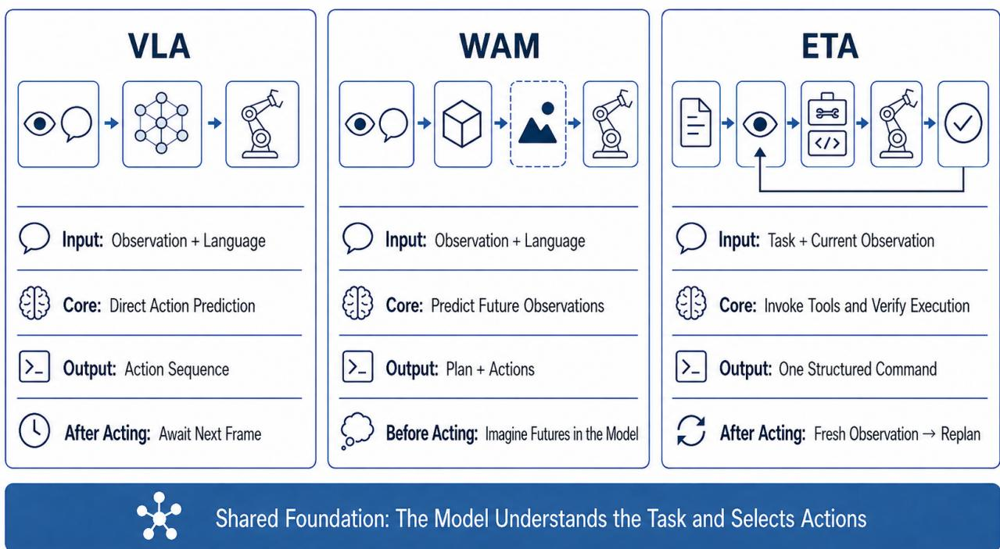  
Figure 2 From action prediction to task-level closed loops: diferent roles of VLA, WAM, and ETA. All three paradigms share a foundation model that understands the task and selects actions. A VLA directly predicts an action sequence, while a WAM imagines possible future observations and actions before execution. An ETA instead issues structured commands through Tools and incorporates fresh post-action World evidence into a task-level runtime closed loop.

These systems are not simply open loop: a generated program can query the World and contain reactive control. The main diference is when the VLM makes the next high-level decision. Program-centric methods generate a composition and then repair or refine it around execution. OpenETA instead selects and combines registered capabilities during execution. After every world-changing Tool call, the Planner receives a fresh observation before it chooses the next Tool. This design makes each physical step easy to trace and control, but it requires more Planner calls and increases inference latency.

## 3 The Embodied Task Agent Paradigm

ETA does not give a model unrestricted control of the world. Instead, it exposes bounded, verifiable atomic capabilities. An ETA is a task-level Agent, not another next-action predictor. It interprets a natural-language goal, decomposes the task, and selects Tools, Skills, and AtomActions. After each action, it reads the new observation and environment receipt. It then decides whether to continue, retry, replan, or request help.

Figure 3 summarizes the conceptual bridge. Digital agents already alternate between understanding a task, invoking Tools, and reading results. ETA keeps this loop but routes every command that can change the physical World through the Interface. The Interface checks the command and authorizes its execution; the Agent cannot act on the World directly.

At turn t, the ETA produces a structured command $c _ { t }$ from the current observation $o _ { t } .$ , goal $^ { g , }$ and working memory mt:

$$
c _ {t} = \pi_ {\mathrm{agent}} (g, o _ {t}, m _ {t}).\tag{1}
$$

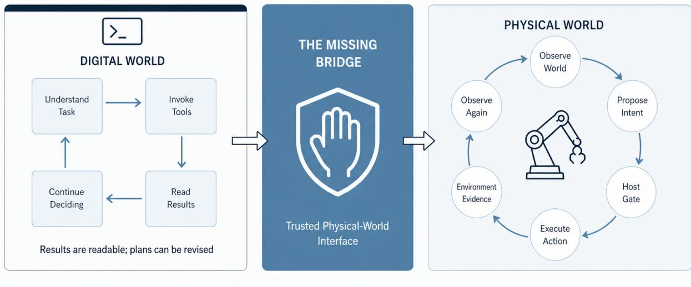  
Figure 3 From digital agents to embodied agents. Digital Tool results are directly readable; a physical Agent additionally needs host-gated execution, fresh observations, and trusted evidence of what changed in the World.

The Interface validates the command structure, Tool contract, provenance, authority, and prerequisite evidence before dispatching an atomic action $a _ { t } \colon$

$$
a _ {t} = \left\{ \begin{array}{l l} \text { dispatch } (c _ {t}), & \text { gate } (c _ {t}, o _ {t}, m _ {t}) = \text { pass }, \\ \varnothing , & \text { otherwise }. \end{array} \right.\tag{2}
$$

The World returns a Tool result $y _ { t } ,$ , an environment receipt $e _ { t } ,$ , and a fresh observation $o _ { t + 1 }$ . Planning resumes only after these records enter working memory.

## 3.1 Runtime invariant

Every ETA execution obeys:

Execute only one world-changing action at a time. Afterward, obtain a fresh observation before executing the next state-dependent action.

This rule prevents an unobserved sequence of world changes and prevents the system from assuming that the scene remained unchanged. If an action succeeds, or its transport status is unknown, without a suficiently fresh state snapshot, the Interface creates a fresh-observation obligation. The system must refresh state first; after repeated observation failures, it stops safely instead of guessing from stale images.

## 3.2 Three roles and their trust boundary

## ETA separates the system into:

1. Agent: understands the task, maintains working memory, and proposes the next structured command.

2. Interface: validates structure, authority, provenance, and prerequisites, and owns Tool dispatch and execution gates.

3. World: executes actions. A simulator can expose ground-truth state, contacts, reward, and termination. A physical system directly exposes robot state, while task relations and completion often require sensors, checker models, or human judgment.

## 4 The OpenETA System

OpenETA is an open-source runtime and experimental framework for the ETA paradigm. It composes foundation models, Tools, Skills, an Interface, World backends, and evaluation in one observe–decide–act–verify loop. It does not require a monolithic model to predict every robot action. We provide two configurations. Full OpenETA uses a broad Tool registry, while OpenETA for Codex is a lightweight plugin that exposes only three embodied Tools. Both configurations follow the same Agent–Interface–World protocol; Section 5 gives their benchmark settings.

We use host to mean this runtime: the software that registers Tools, checks Agent commands, and dispatches approved actions. The host is outside the model-controlled Agent.

OpenETA separates intelligence from execution authority: the Agent decides what it wants to do, the Interface decides whether it may, and the World states what actually happened. Every observation, command, action, receipt, and decision rationale enters a replayable trajectory, allowing models, Tools, Skills, World backends, and checkers to be replaced under one protocol.

## 4.1 Agent

Tool A Tool is a host-registered atomic capability with stable parameter and return contracts. The current default registry contains 44 Tools. Each Tool also declares a side-efect class—read\_only, planning, bookkeeping, or world\_mutating—which determines whether calls may be batched and whether a fresh observation is required afterward.

Table 1 Major OpenETA Tool categories.

| Category | Representative Tools | Role |
|---|---|---|
| Perception and localization | observe, retrieve_asset_reference, molmopoint, sam3, enhance_depth | Acquire observations, retrieve target references, localize and segment targets, and create traceable visual artifacts. |
| Geometry and manipulation planning | grasp_pose_estimate, anygrasp, contact_graspanet, graspgenx, anyplace | Generate grasp or placement proposals, transform coordinates, and retain candidate provenance and scores. |
| Safety and physical execution | ik_preview_check, obstacle_avoidance, move_to, follow_eef_trajectory, gripper_control | Check feasibility and change robot or environment state through atomic actions. |
| Environment and evidence | create_simulator_env, close_simulator_env, materialize_mcp_images | Manage environment lifecycle, materialize remote observations, and attach environment receipts. |
| Agent support | save_memory, get_memory, compact_memory, python_exec, web_search, register_skill | Manage working memory, bounded code, information retrieval, and editable Skills. |

The registry wraps specialist methods behind stable OpenETA contracts rather than exposing their native APIs directly. Representative backends include SAM 3 for concept-conditioned segmentation [45], AnyGrasp and Contact-GraspNet for 6-DoF grasp proposals [46, 47], and AnyPlace for object placement [48]. Collision-aware trajectory generation can likewise be supplied by the cuRobo family [49, 50]. The Interface normalizes these heterogeneous outputs and retains their provenance, while the Planner still owns the next task-level decision.

Skill A Skill is editable textual guidance describing how the model should reason, check, and recover. It never executes a hidden action sequence; the Agent must still select every atomic Tool explicitly.

Response and Soul Response supports dialogue, help requests, and completion reports. Soul describes identity, behavioral boundaries, and risk preferences that persist across tasks and sessions. Both influence decisions but receive no physical execution authority.

AtomAction An AtomAction is an execution primitive that can physically change the World, such as end-efector motion, trajectory following, or gripper control. It is the physical subset of world\_mutating Tools; Skill text cannot bypass AtomActions to modify the World.

## 4.2 Interface

Stable contracts and normalized results The Planner submits only two structured command types: tool\_call and response. The host runtime defines Tool names, parameters, handlers, and side-efect declarations. The Agent cannot rewrite them at runtime. Every return is normalized into ToolResult, which separately records outputs, artifact references, state deltas, diagnostics, and environment receipts.

Execution gates and obligations Read-only or planning calls may be batched under bounded conditions, whereas world\_mutating actions execute one at a time. The Interface blocks execution if the target is unconfirmed, a safety check fails, or prerequisite evidence is missing. Explicit mask selection, grasp-candidate switching, and post-action observation become obligations in working memory; unresolved obligations constrain subsequent Tool calls.

Trusted receipts and backend isolation The Agent sees stable Tool semantics; the Interface connects them to simulators or robots through adapter boundaries such as MCP. Low-level joint vectors, controller expansion, and internal environment objects remain hidden from the planner. Reward and termination are accepted only when host-attested provenance, execution ID, and session ID match the current turn; an ordinary Tool handler cannot mint oficial reward. Appendix F specifies the minimum command, result, receipt, obligation, and rollout schemas.

## 4.3 World

The World layer is implemented by two families of Model Context Protocol (MCP) services. Simulator MCP owns environment lifecycle, normalized observations, atomic motion and gripper execution, reward, and termination. Real robot MCP exposes the corresponding camera, robot-state, motion, and gripper capabilities through device-specific drivers and safety limits. The Interface maps both services to the same planner-facing Tool contracts, so the Agent does not need simulator- or robot-specific control code.

This separation is also a security and evaluation boundary. The Agent cannot directly import a simulator object, read privileged ground-truth state, call an unregistered controller, or fabricate reward. It can access only fields and operation intentionally exposed by the MCP service. Simulator contacts, object poses, and oficial task verdicts may be used internally to construct a host-attested receipt, but privileged values that are not part of the declared observation contract never enter Planner context. The same boundary prevents a powerful coding model from “solving” a benchmark by inspecting hidden state or bypassing the physical action path.

## 5 Simulation Experiments

## 5.1 Experimental setup

## 5.1.1 Full OpenETA configuration

We evaluate OpenETA’s complete closed loop on the LIBERO manipulation benchmark [51]. The formal scope comprises Spatial, Object, Goal, and Long / LIBERO-10: 4 suites with 10 tasks each. OpenETA receives no additional task-specific policy training; it composes foundation-model reasoning, target localization, segmentation, grasp planning, motion control, and environment checking Tools. Its Planner is GPT-5.6 Luna (gpt-5.6-luna) with medium reasoning efort.

The descriptive baseline covers 40 tasks, each evaluated on 10 seeds, for 400 episodes. Every cell uses the same suite-specific budget in read-only evaluation mode, loads no experience generated during evaluation, and allows neither human nor agent assistance. Success is accepted only from an oficial positive LIBERO reward in a trusted environment receipt. The evaluation manifest freezes the task catalog, models and prompts, Tool contracts, policy tree, object memory, budgets, and source-record hashes. This fixed task–seed protocol requires a completion receipt before aggre gate results are rendered; it contains no task-qualification stage. Appendix B explains the full protocol and how we mark episodes afected by simulator failures. Appendix C lists each task result and the trace used to verify it. We place LIBERO-Pro outside the formal scope and do not extrapolate robustness to it; a future evaluation requires its own preregistered manifest.

## 5.1.2 OpenETA for Codex configuration

We evaluate OpenETA for Codex on 130 LIBERO tasks: the four standard suites (Spatial, Object, Goal, and LIBERO-10, 10 tasks each) and LIBERO-90. The Agent uses only three embodied Tools: observe, mark\_point, and move\_to.

Design motivation. Coding agents solve many tasks through a small set of stable operations, such as file access, edit ing, shell execution, search, and version control. OpenETA for Codex applies the same idea to embodied control. It keeps the physical interface small and leaves task decomposition, target selection, and spatial reasoning to the multi modal Planner.

The interaction loop needs three Tools. observe returns live images. mark\_point maps a point selected in an image to a 3D World coordinate. move\_to moves the gripper to a target pose. Evaluator lifecycle calls do not add perception or manipulation capability.

observe. The Agent requests only the views needed for its next decision. In LIBERO, it can request a fixed thirdperson view, a wrist view, or orthographic views along the World X, Y, and Z axes. Each image has 512×512 resolution.

mark\_point. This Tool turns the Agent’s 2D point selection into a 3D coordinate. It supports two modes.

Multi-view mode. The Agent first selects a pixel in one orthographic view. The Tool returns the other two views and draws the corresponding projected ray. The Agent selects a second point on one of these rays, which resolves the 3D World coordinate.

Single-view mode. For a point on a visible object surface, the Agent selects one pixel in a camera view. The Tool returns the first surface intersection along that camera ray. This mode is suficient for many pick-and-place tasks.

In both modes, the Tool returns the World XYZ coordinate and an image that marks the selected point.

move\_to. This Tool moves the gripper to a target position and orientation. The Agent specifies orientation with two vectors: an approach direction and a jaw direction. These vectors are easier to interpret than raw rotation angles.

The Tool accepts either an absolute target or a relative change from the current pose. After each action, it returns the gripper aperture. The Agent can use this value to check whether the gripper holds an object. Before a close command, the Tool also renders the target gripper pose. The Agent can inspect this preview and adjust the pose before execution.

Three evaluator-owned lifecycle calls, report\_issue, check\_task and finish\_episode, expose no additional perception or manipulation capability. We compare GPT-5.6 Luna, GPT-5.6 Terra, and GPT-5.6 Sol at medium reasoning efort. All three use the same startup prompt, Tool schemas and result formats, visual feedback contract, task catalog, and ordered seeds. We report task-level PASS@k over seeds 0–4, and native LIBERO task checkers provide the success verdict.

## 5.2 Results and failure modes

## 5.2.1 Full OpenETA baseline

The frozen evaluation records 56/400 episode successes (14.0%) on the complete matrix of 40 tasks and 10 preregistered seeds per task. Every task–seed cell is run once, with no qualification filter or post-hoc rerun. 3 LIBERO-10 episodes lack complete result records because simulator handles expired after approximately 1800 seconds. The batch is therefore a complete descriptive baseline but does not satisfy a strict infrastructure-clean standard. The primary result remains 56/400; 56/397=14.11% after excluding the 3 cells is diagnostic only and cannot replace the preregistered 400-episode metric.

Table 2 OpenETA episode success on the fixed LIBERO matrix. The Planner is GPT-5.6 Luna (gpt-5.6-luna) with medium reasoning efort.

| Suite | Success/denom. | Rate | Mean turns (resource n) |
|---|---|---|---|
| Spatial | 8/100 | 8.0% | 47.5 (100) |
| Object | 26/100 | 26.0% | 31.2 (100) |
| Goal | 21/100 | 21.0% | 36.8 (100) |
| Long / LIBERO-10 | 1/100 | 1.0% | 58.5 (97) |
| Overall | 56/400 | 14.0% | 43.4 (397) |

Stratified descriptive analysis. Suite-level episode-success estimates range from 1.0% (Long / LIBERO-10) to 26.0% (Object), a descriptive range of 25.0 percentage points. Of 40 tasks, 22 score 0/10, 0 score 10/10, and 18 have mixed outcomes across seeds; 18/40 tasks therefore succeed at least once. Batch wall time is 19.59 hours. Complete perepisode resource records exist for 397/400 cells and sum to 17,231 turns, 17,141 Tool calls, and approximately 228.2M tokens. Observed peak trace concurrency is 10, peak provider concurrency is 2, and provider queue timeouts are 0.

Table 3 Resources stratified by final episode verdict. Only episodes with complete resource fields are included; wall time is the episode usage elapsed value.

| Stratum | Complete n | Mean turns | Mean Tool calls | Mean wall time (s) |
|---|---|---|---|---|
| Success | 56 | 30.7 | 30.7 | 1045.0 |
| Failure | 341 | 45.5 | 45.2 | 1866.6 |

Among 344 failed episodes, the most common mutually exclusive terminal label is episode\_timeout (215/344, 62.5%). 3 simulator unknown-handle cells are infrastructure contamination and remain zeros in the standard 400- episode denominator; the 56/397=14.11% exclusion diagnostic does not replace the primary metric. These strata locate computational burden and terminal stage. Early stopping, budget exhaustion, and task dificulty jointly afect resources, so mean-resource diferences are not causal efects of computation on success. Suites cover diferent tasks, and their descriptive range is not a paired significance test. The categories cover mutually exclusive terminal reasons for all 400 preregistered cells. simulator\_unknown\_handle is marked separately as infrastructure contamination; the others identify where task execution stopped. Tool-return success, stage reachability, and post-hoc observation are not promoted to task success, and a terminal label alone is not treated as an evidenced root cause.

Table 4 Mutually exclusive terminal failures in the fixed LIBERO matrix.

| Terminal class | Episodes | Share of failures | Type |
|---|---|---|---|
| episode_timeout | 215 | 62.5% | Task terminal |
| unattended_ask_human | 66 | 19.2% | Task terminal |
| max_turns | 35 | 10.2% | Task terminal |
| status_report_without_reward | 24 | 7.0% | Task terminal |
| simulator_unknown_handle | 3 | 0.9% | Infrastructure |
| remote_episode_terminated_without_reward | 1 | 0.3% | Task terminal |
| All failures | 344 | 100.0% | - |

Because 3 cells are afected by simulator TTL expiration, the exclusion diagnostic uses 56/397 episodes. It cannot replace the preregistered 400-episode descriptive result.

The system remains slow and expensive. Foundation-model inference, perception, verification, and simulation latency accumulate over long episodes. Among the 400 terminal outcomes, episode\_timeout is the dominant failure label, followed by unattended ask\_human, maximum turns, and status reports without oficial reward. Every success has an oficial positive LIBERO reward, and actual human or agent assistance is zero. The 66 ask\_human outcomes therefore record unavailable help requests retained as failures, not assisted results.

These mutually exclusive terminal labels identify where a trajectory stopped; they do not by themselves establish a physical root cause. Object and Goal have higher point estimates than Spatial, while Long / LIBERO-10 has one success. Together with timeout dominance and only 18/40 tasks succeeding at least once, the evidence points to longhorizon subgoal tracking, perceptual rechecking, placement relations, and remaining-budget coordination as important bottlenecks. When ambiguity causes a safe stop or help request, OpenETA retains the last trusted state, unresolved obligations, and stop condition. This distinguishes safe abstention from unexplained termination, but never relabels abstention as task success. Appendix D defines the failure taxonomy and evidence requirements.

## 5.2.2 OpenETA for Codex results

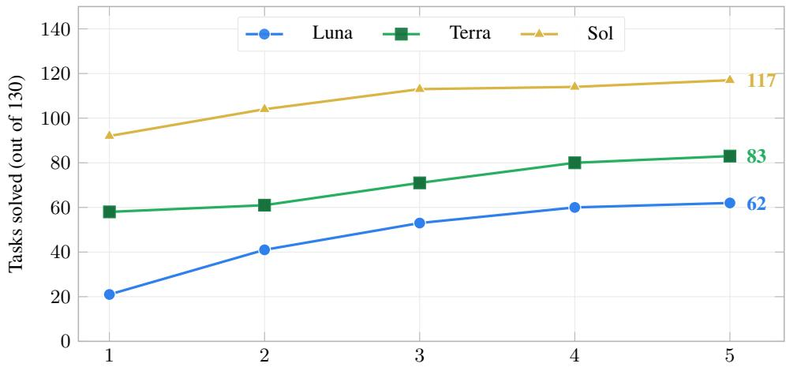  
Evaluation budget k (ordered seeds per task)  
Figure 4 OpenETA for Codex task-level Pass@k across 130 LIBERO tasks. GPT-5.6 Luna, GPT-5.6 Terra, and GPT-5.6 Sol use the same Tool and visual contracts, medium reasoning efort, and ordered seeds. Pass@k counts a task as solved if any of its first k ordered-seed episodes succeeds.

Figure 4 shows how task coverage accumulates across the five ordered evaluation seeds. At PASS@1, Luna, Terra, and Sol solve 21, 58, and 92 tasks, respectively. Coverage rises to 62 (47.7%), 83 (63.8%), and 117 (90.0%) at PASS@5. Performance rises with Planner strength under the same Tool interface. Sol performs especially well on tasks that require precise grasp-point localization, where it produces fewer empty grasps than Terra and Luna. It also uses the move\_to preview more often before acting. Appendix B reports the suite-level PASS@k results.

## 5.2.3 Qualitative trace visualization for openeta

Figure 5 shows how the same Tool-mediated closed loop appears in a successful local LIBERO rollout: each panel is a post-call observation, the next decision is made from the updated scene, and completion is accepted only with a trusted oficial reward. This plate is a qualitative interface demonstration, not a cell from the frozen fixed matrix; it contributes neither a success nor a failure to Table 2. Additional local success plates appear in Appendix C.

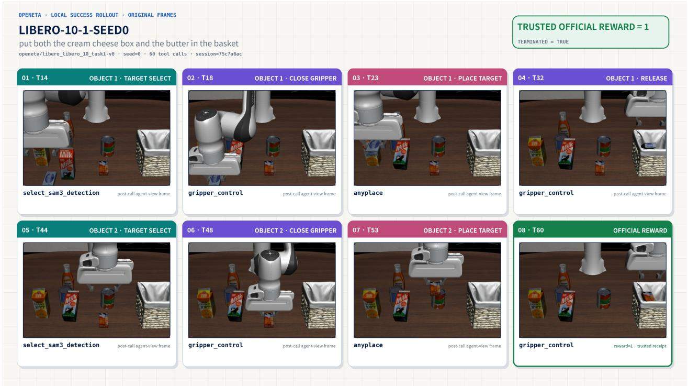  
Figure 5 Qualitative local LIBERO-10 success trajectory. The two-object rollout exposes target selection, post-action observation, placement, release, and trusted reward as separate decision boundaries. It visualizes runtime semantics only and is not part of the frozen 400-episode denominator.

## 6 Constrained Agent Self-Evolution

OpenETA records observations, Tool calls, task state, environment receipts, and failure evidence in every trajectory. Agent self-evolution asks whether this experience can improve later behavior. The model may propose an update, but it cannot rewrite Tools, controllers, or safety rules. The runtime tests each update before it can afect future execution. This design builds on reflection, experience retrieval, and skill libraries [2, 3, 11], but adds checks required for physical action.

## 6.1 Notation

Let T denote trusted trajectories and C the fixed Tool and safety contracts. The current Skill or strategy is S, and a proposed update is u. A paired evaluation manifest M fixes the task, seed, budget, and comparison protocol. The runtime promotes u only if it passes every gate defined below.

## 6.2 Method

We test three forms of update, from broad to narrow. A task-local Skill edits guidance for the full pick-and-place workflow. An exact-task playbook is extracted from a successful trajectory and loaded only when the environment, suite, task index, and task text all match. A stage-local delta compares a successful and a failed trajectory from the same task. It records one symbolic trigger and one change in action for a specific stage.

No update may store world coordinates, reuse historical poses, redefine atomic Tools, or bypass safety checks. It also cannot bypass target selection, attachment verification, placement, release, or oficial reward. Candidate generation and candidate evaluation use separate contexts.

The model can generate a candidate, but only the OpenETA runtime can promote it. The runtime first checks the candidate, then reproduces the original task, and finally tests held-out tasks for gains and regressions. This separation prevents a model-written “lesson learned” from gaining execution authority without evidence.

Table 5 Constrained candidate generation and promotion.

| Input: trusted trajectories T, fixed contracts C, base capability S, paired manifest M |  |
|---|---|
| Output: promoted candidate u or an auditable rejection record |  |
| 1 | Generate u from T and S without access to evaluation results. |
| 2 | Reject u if it violates the schema or any invariant in C. |
| 3 | Review u in a context isolated from candidate generation. |
| 4 | Reject u if the review does not accept it. |
| 5 | Replay S and u on the same task and seed from M. |
| 6 | Reject u if it cannot reproduce trusted task success. |
| 7 | Compare S and u on paired held-out tasks from M. |
| 8 | Reject u if it shows no objective gain. |
| 9 | Reject u if it introduces a safety or contract regression. |
| 10 | Promote u with provenance, version, and rollback metadata. |

Formally, the promotion rule is

$$
\operatorname{Promote} (u) = D (u) \wedge Q (u) \wedge R (u) \wedge H (u),\tag{3}
$$

where D is the deterministic contract check, Q is the isolated review, R is same-task replay, and H is paired held-out evaluation. A candidate must pass all four gates.

## 6.3 Experimental setting

We study self-evolution on LIBERO Spatial. In every paired comparison, the baseline and candidate use the same Tool contracts, base Skill, grasp policy, calibration, task seed, and resource budget. The only diference is whether the candidate experience is available. Oficial environment reward is the success criterion. Attachment, placement, release, timeout, and invariant events are diagnostic signals; they never replace oficial success.

The five studies form an adaptive exploratory sequence. Each study was designed after inspecting the previous one. They are not five independent trials under one preregistered protocol, so we report their results separately.

## 6.4 Results

Table 6 Summary of OpenETA self-evolution experiments. “Baseline/candidate” denotes paired runs without and with candidate experience. Success always means oficial environment reward.

| Update | Evaluation | Official success | Main result |
|---|---|---|---|
| Online multi-round Skill | 10 tasks, one seed, three rounds; two runs | 0 → 1 → 0/10; 0 → 0 → 3/10 | A later round can find a success, but the gain does not persist. |
| Task-local Skill | 3 tasks × 10 held-out seeds; 60 episodes | baseline 0/30; candidate 0/30 | The candidate reaches attachment and placement stages less often. |
| Exact-task playbook | 3 tasks × 10 held-out seeds; 60 episodes | baseline 4/30; candidate 1/30 | The candidate uses more turns and times out more often. |
| Stage-local delta v1 | 3 same-seed replay pairs | baseline 0/3; candidate 0/3 | Neither arm reproduces success, so held-out evaluation does not run. |
| Contrastive stage-local delta v2 | 1 valid same-seed replay pair | baseline 0/1; candidate 0/1 | The update changes no key decision and adds 1 premature gripper opening. |

No candidate passes all promotion gates. Broad Skill edits sometimes change a single run, but the efect is not stable. The exact-task playbook also performs worse than its paired baseline. The two stage-local versions fail to reproduce the source success, so neither reaches held-out evaluation.

The main result is therefore about control, not performance improvement. The promotion gates keep unsupported, inefective, or regressive updates out of the shared capability library. However, the current update methods show no reproducible improvement in task success. Most candidates add another visual check or recovery rule; they do not change the underlying perception or control Tools. These extra steps can increase Planner turns and timeouts without fixing the failure

Future work needs updates with clearer causes and efects. The system should record when a rule applies, whether the Agent follows it, and how the action difers from the failed trajectory. A gain should count only when it reproduces the original success and improves paired held-out tasks without new violations. Appendix E provides per-task results, stage statistics, resource use, validity limits, and experiment identifiers.

## 7 From Simulation Closed Loops to Real Robots

OpenETA does not bind task-level intelligence to one simulator or robot. The Agent consumes normalized observations and proposes structured commands; backend adapters translate observation, motion, grasp, and release Tools into sim ulator or robot requests. When backends preserve functional semantics, task decomposition, working memory, Skills, recovery, and verification remain reusable.

What transfers is a task-level closed loop. Target descriptions, Tool contracts, execution gates, fresh-observation obligations, checking procedures, and trajectory formats can transfer; cameras, coordinate frames, motion controllers, gripper interfaces, sensor calibration, and device-specific safety constraints must be replaced and revalidated.

A typical migration proceeds as follows:

1. validate the observe–act–verify loop in simulation;

2. integrate the robot backend and calibrate frames, cameras, and end efectors;

3. verify each Tool’s functional semantics at low speed and within a restricted workspace under emergency-stop supervision;

4. test post-action observation, timeout recovery, and request idempotency; and

5. run complete tasks in a controlled workspace while retaining the same evidence-chain format used in simulation.

## 7.1 Qualitative Hardware Demonstration

Before the formal second-stage study, we recorded two development runs on a UR5e arm with a Robotiq gripper. One recording visibly covers a complete sponge-to-tray sequence: contact approach, a lift probe and attachment check, multiwaypoint transport, and final placement (Figure 6). The other visibly establishes a bell-pepper grasp and transport, but its final in-basket relation is not supported by the archived view. These recordings show that the closed-loop Tool pipeline can drive the hardware through substantive manipulation stages.

Development testing exposed two coupled Sim2Real bottlenecks. First, depth from the RealSense D435i wrist and supplementary third-person cameras and the RealSense L515 main third-person camera was substantially less complete than simulator depth. Depth-estimation enhancement improved the input but did not reliably restore geometry suficient for high-quality pose estimates. Second, some lateral-grasp target poses were followed by acceleration-limit protective stops. Trace review suggests controller PD tuning or trajectory shaping as a possible contributor, but the retained recordings do not establish a causal diagnosis. Both issues motivate the frozen calibration, depth-validity, motion-limit, and per-trial evidence checks planned for the second-stage evaluation.

The frozen release evidence remains interface integration. Its source snapshot does not establish SDK availability, device connectivity, calibration quality, primitive success, task success, or safety certification; the development recordings remain qualitative demonstrations.

“Transfer” does not mean engineering-free adaptation, nor do simulation results imply physical safety. Collision checking, control frequency, emergency stop, payload limits, calibration error, and shared-workspace risk require devicespecific validation. Appendix G separates interface integration, primitive validation, and task validation, and lists the calibration, limits, emergency-stop, idempotency, and supervision evidence required for each physical batch.

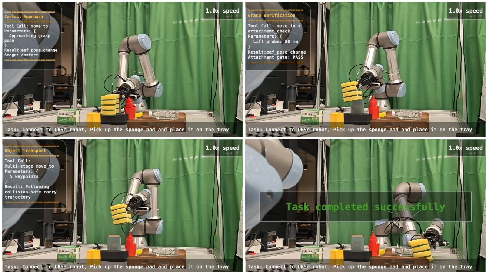  
Figure 6 Qualitative UR5e sponge-to-tray demonstration. Clockwise from the upper left: contact approach; lift-probe attachment verification; final placement on the tray; and multi-waypoint transport. The panels are selected frames from one retained successful recording, not independent trials or evidence for a success rate.

Real-robot demonstrations and updates will appear at:

https://github.com/OpenMOSS/OpenETA

## 8 Limitations and Future Work

OpenETA connects multimodal planning, atomic Tools, textual Skills, session-level memory, simulation and perception interfaces, parallel evaluation, and immutable trajectory records in one reproducible loop. The frozen LIBERO matrix records 56/400 successful episodes, and 18/40 tasks succeed at least once. Long / LIBERO-10 is the weakest suite. Simulator TTL expiration afects 3 cells. Current limitations include:

• timeouts dominate the formal failure labels, and subgoal progress, budget, and remaining-time management remain inadequate in multi-object tasks;

• placement relations, release timing, and attachment stability remain major bottlenecks;

• bimanual coordination, dynamic contact, and mobile manipulation lack mature Tools and checkers;

• simulation cannot establish real-robot safety, control frequency, emergency-stop behavior, calibration, or payload limits; and

• current general-purpose models do not reliably adopt a habit of observing and correcting after every physical action.

Next, we will remove simulator-session TTL and resource-record gaps, then rerun the frozen matrix under an infrastructure-clean protocol. We will reduce context and Tool-call cost while improving long-horizon memory and recovery. We will also expand the Tool set toward bimanual, contact-rich, and mobile tasks. Finally, we will connect trusted rollouts, training, regression tests, and redeployment in a self-improvement loop. Figure 7 summarizes this staged agenda and the evidence gates required before progressing to broader embodiments and harder tasks.

We also plan to let the Agent move a free camera around a selected region. This extra viewpoint can reduce occlusion before grasping or placement. The resulting interaction traces may also provide training data for spatial reasoning models.

## OpenETA Roadmap: From Task Loops to Verifiable Experience

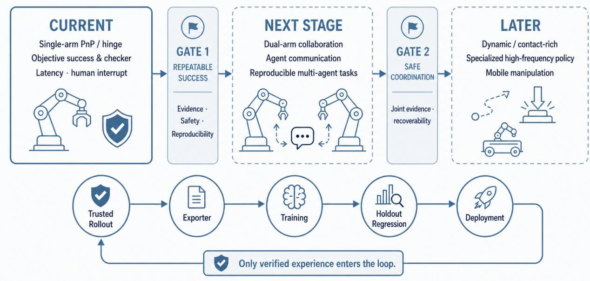  
Figure 7 OpenETA research roadmap. Progression from current single-arm tasks to multi-agent coordination and later contact rich or mobile manipulation is gated by repeatable success, safety, reproducibility, and recoverability. The later stages and training loop are research targets, not claims about the current release.

Future VLAs and WAMs can be invoked as high-level ETA capabilities. Specialized VLAs such as CoRE-VLA and Gemini Robotics [19, 52] may provide short-horizon control for dexterous, contact-rich, or multi-embodiment tasks that are dificult to express through general code composition. A WAM may predict future states and compare plan conse quences. Omnimodal embodied-agent systems further suggest treating smart-home gateways, Web search, interaction, and memory as capabilities in the same task loop [44]. The task-level Agent chooses when to invoke each capability from current evidence, while the Interface retains execution gating and post-action verification for state-changing physical calls.

## 9 Conclusion

Embodied intelligence needs stronger models, but scale alone does not create a trustworthy physical closed loop. A system must continually answer: what was observed, what may change, who authorizes the change, what actually happened, and under what conditions the resulting experience remains credible.

ETA realizes these questions as a protocol among Agent, Interface, and World. OpenETA implements it with atomic Tools, side-efect classes, execution gates, trusted environment receipts, fresh-observation obligations, and replayable trajectories. Without task-specific policy training, the frozen LIBERO matrix achieves 56/400 episode successes, and 18/40 tasks succeed at least once. Because 3 cells are contaminated by simulator TTL expiration, this is a complete descriptive baseline rather than a strictly infrastructure-clean confirmatory result. OpenETA for Codex evaluates the same three-Tool interface with three Planners on 130 LIBERO tasks. At PASS@5, GPT-5.6 Luna, Terra, and Sol solve 62, 83, and 117 tasks, respectively. Sol also solves 92 tasks on the first seed. These results show that stronger general purpose Planners can use the same small physical interface more efectively. The real-robot backend currently has interface-level integration only; it supports no claim of primitive execution, task execution, or real-robot audited success rate. Retained qualitative recordings show a complete sponge-to-tray example and expose engineering priorities, but do not raise that formal evidence level.

No self-evolution candidate passed the promotion gate. The evidence therefore supports the mechanism claim that experience should afect execution only after paired non-regression validation, not a performance-improvement claim. Simulation failures and interface-integration work jointly expose current limits in localization, placement, latency, and physical safety.

When every observation, command, action, and result leaves a structured record, an embodied system becomes easier to evaluate, debug, and improve. It can then learn from verified physical experience as well as from larger foundation models.

## References

[1] Shunyu Yao, Jefrey Zhao, Dian Yu, Nan Du, Izhak Shafran, Karthik R. Narasimhan, and Yuan Cao. React: Synergizing reasoning and acting in language models. In The Eleventh International Conference on Learning Representations, ICLR 2023, Kigali, Rwanda, May 1-5, 2023. OpenReview.net, 2023. URL https://openreview.net/forum?id=WE\_vluYUL-X.

[2] Noah Shinn, Federico Cassano, Ashwin Gopinath, Karthik Narasimhan, and Shunyu Yao. Reflexion: language agents with verbal re inforcement learning. In Alice Oh, Tristan Naumann, Amir Globerson, Kate Saenko, Moritz Hardt, and Sergey Levine, editors, Ad vances in Neural Information Processing Systems 36: Annual Conference on Neural Information Processing Systems 2023, NeurIPS 2023, New Orleans, LA, USA, December 10 - 16, 2023, 2023. URL http://papers.nips.cc/paper\_files/paper/2023/hash/ 1b44b878bb782e6954cd888628510e90-Abstract-Conference.html.

[3] Guanzhi Wang, Yuqi Xie, Yunfan Jiang, Ajay Mandlekar, Chaowei Xiao, Yuke Zhu, Linxi Fan, and Anima Anandkumar. Voyager: An openended embodied agent with large language models. Trans. Mach. Learn. Res., 2024, 2024. URL https://openreview.net/forum?id= ehfRiF0R3a.

[4] Andrej Karpathy. autoresearch: Autonomous research on language-model training. GitHub repository, 2026. URL https://github.com karpathy/autoresearch.

[5] Jenny Zhang, Bingchen Zhao, Wannan Yang, Jakob Foerster, Jef Clune, Minqi Jiang, Sam Devlin, and Tatiana Shavrina. Hyperagents. CoRR, abs/2603.19461, 2026. URL https://arxiv.org/abs/2603.19461.

[6] Brianna Zitkovich, Tianhe Yu, Sichun Xu, Peng Xu, Ted Xiao, Fei Xia, Jialin Wu, Paul Wohlhart, Stefan Welker, Ayzaan Wahid, Quan Vuong, Vincent Vanhoucke, Huong T. Tran, Radu Soricut, Anikait Singh, Jaspiar Singh, Pierre Sermanet, Pannag R. Sanketi, Grecia Salazar, Michael S. Ryoo, Krista Reymann, Kanishka Rao, Karl Pertsch, Igor Mordatch, Henryk Michalewski, Yao Lu, Sergey Levine, Lisa Lee, Tsang-Wei Edward Lee, Isabel Leal, Yuheng Kuang, Dmitry Kalashnikov, Ryan Julian, Nikhil J. Joshi, Alex Irpan, Brian Ichter, Jasmine Hsu, Alexander Herzog, Karol Hausman, Keerthana Gopalakrishnan, Chuyuan Fu, Pete Florence, Chelsea Finn, Kumar Avinava Dubey, Danny Driess, Tianli Ding, Krzysztof Marcin Choromanski, Xi Chen, Yevgen Chebotar, Justice Carbajal, Noah Brown, Anthony Brohan, Montserrat Gonzalez Arenas, and Kehang Han. RT-2: vision-language-action models transfer web knowledge to robotic control. In Jie Tan, Marc Toussaint, and Kourosh Darvish, editors, Conference on Robot Learning, CoRL 2023, 6-9 November 2023, Atlanta, GA, USA, volume 229 of Proceedings ofMachine Learning Research, pages 2165–2183. PMLR, 2023. URL https://proceedings.mlr.press/v229/zitkovich23a.html.

[7] Moo Jin Kim, Karl Pertsch, Siddharth Karamcheti, Ted Xiao, Ashwin Balakrishna, Suraj Nair, Rafael Rafailov, Ethan Paul Foster, Pannag R. Sanketi, Quan Vuong, Thomas Kollar, Benjamin Burchfiel, Russ Tedrake, Dorsa Sadigh, Sergey Levine, Percy Liang, and Chelsea Finn. Open vla: An open-source vision-language-action model. In Pulkit Agrawal, Oliver Kroemer, and Wolfram Burgard, editors, Conference on Robot Learning, 6-9 November 2024, Munich, Germany, volume 270 of Proceedings ofMachine Learning Research, pages 2679–2713. PMLR, 2024. URL https://proceedings.mlr.press/v270/kim25c.html.

[8] Siyin Wang, Junhao Shi, Zhaoyang Fu, Xinzhe He, Feihong Liu, Chenchen Yang, Yikang Zhou, Zhaoye Fei, Jingjing Gong, Jinlan Fu, Mike Zheng Shou, Xuanjing Huang, Xipeng Qiu, and Yu-Gang Jiang. World action models: The next frontier in embodied AI. CoRR, abs/2605.12090, 2026. doi: 10.48550/ARXIV.2605.12090. URL https://doi.org/10.48550/arXiv.2605.12090.

[9] Xueyang Zhou, Yangming Xu, Guiyao Tie, Yongchao Chen, Guowen Zhang, Duanfeng Chu, Pan Zhou, and Lichao Sun. LIBERO-PRO: towards robust and fair evaluation of vision-language-action models beyond memorization. CoRR, abs/2510.03827, 2025. doi: 10.48550/ARXIV.2510. 03827. URL https://doi.org/10.48550/arXiv.2510.03827.

[10] Shmuel Berman, Michael Ilie, Jia Deng, and Daniel Freeman. Claude plays robotics. Anthropic research post, 2026. URL https://www. anthropic.com/research/claude-plays-robotics. Accessed 2026-08-01.

[11] Andrew Zhao, Daniel Huang, Quentin Xu, Matthieu Lin, Yong-Jin Liu, and Gao Huang. Expel: LLM agents are experiential learners. In Michael J. Wooldridge, Jennifer G. Dy, and Sriraam Natarajan, editors, Thirty-Eighth AAAI Conference on Artificial Intelligence, AAAI 2024, Thirty-Sixth Conference on Innovative Applications ofArtificial Intelligence, IAAI 2024, Fourteenth Symposium on Educational Advances in Artificial Intelligence, EAAI 2024, February 20-27, 2024, Vancouver, Canada, pages 19632–19642. AAAI Press, 2024. doi: 10.1609/AAAI. V38I17.29936. URL https://doi.org/10.1609/aaai.v38i17.29936

[12] Danny Driess, Fei Xia, Mehdi S. M. Sajjadi, Corey Lynch, Aakanksha Chowdhery, Brian Ichter, Ayzaan Wahid, Jonathan Tompson, Quan Vuong, Tianhe Yu, Wenlong Huang, Yevgen Chebotar, Pierre Sermanet, Daniel Duckworth, Sergey Levine, Vincent Vanhoucke, Karol Hausman, Marc Toussaint, Klaus Gref, Andy Zeng, Igor Mordatch, and Pete Florence. Palm-e: An embodied multimodal language model. In Andreas Krause, Emma Brunskill, Kyunghyun Cho, Barbara Engelhardt, Sivan Sabato, and Jonathan Scarlett, editors, International Conference on Machine Learning, ICML 2023, 23-29 July 2023, Honolulu, Hawaii, USA, volume 202 of Proceedings ofMachine Learning Research, pages 8469–8488. PMLR, 2023. URL https://proceedings.mlr.press/v202/driess23a.html.

[13] Open X.-Embodiment Collaboration, Abhishek Padalkar, Acorn Pooley, Ajinkya Jain, Alex Bewley, Alexander Herzog, Alex Irpan, Alexander Khazatsky, Anant Raj, Anikait Singh, Anthony Brohan, Antonin Rafin, Ayzaan Wahid, Ben Burgess-Limerick, Beomjoon Kim, Bernhard Schölkopf, Brian Ichter, Cewu Lu, Charles Xu, Chelsea Finn, Chenfeng Xu, Cheng Chi, Chenguang Huang, Christine Chan, Chuer Pan, Chuyuan Fu, Coline Devin, Danny Driess, Deepak Pathak, Dhruv Shah, Dieter Büchler, Dmitry Kalashnikov, Dorsa Sadigh, Edward Johns, Federico Ceola, Fei Xia, Freek Stulp, Gaoyue Zhou, Gaurav S. Sukhatme, Gautam Salhotra, Ge Yan, Giulio Schiavi, Gregory Kahn, Hao Su, Haoshu Fang, Haochen Shi, Heni Ben Amor, Henrik I. Christensen, Hiroki Furuta, Homer Walke, Hongjie Fang, Igor Mordatch, Ilija Radosavovic, and

et al. Open x-embodiment: Robotic learning datasets and RT-X models. CoRR, abs/2310.08864, 2023. doi: 10.48550/ARXIV.2310.08864. URL https://doi.org/10.48550/arXiv.2310.08864.

[14] Dibya Ghosh, Homer Rich Walke, Karl Pertsch, Kevin Black, Oier Mees, Sudeep Dasari, Joey Hejna, Tobias Kreiman, Charles Xu, Jianlan Luo, You Liang Tan, Lawrence Yunliang Chen, Quan Vuong, Ted Xiao, Pannag R. Sanketi, Dorsa Sadigh, Chelsea Finn, and Sergey Levine. Octo: An open-source generalist robot policy. In Dana Kulic, Gentiane Venture, Kostas E. Bekris, and Enrique Coronado, editors, Robotics: Science and Systems XX, Delft, The Netherlands, July 15-19, 2024, 2024. doi: 10.15607/RSS.2024.XX.090. URL https://doi.org/10.15607/ RSS.2024.XX.090.

[15] Kevin Black, Noah Brown, Danny Driess, Adnan Esmail, Michael Equi, Chelsea Finn, Niccolo Fusai, Lachy Groom, Karol Hausman, Brian Ichter, Szymon Jakubczak, Tim Jones, Liyiming Ke, Sergey Levine, Adrian Li-Bell, Mohith Mothukuri, Suraj Nair, Karl Pertsch, Lucy Xiaoyang Shi, James Tanner, Quan Vuong, Anna Walling, Haohuan Wang, and Ury Zhilinsky. π : A vision-language-action flow model for general robot control. CoRR, abs/2410.24164, 2024. doi: 10.48550/ARXIV.2410.24164. URL https://doi.org/10.48550/arXiv.2410.24164.

[16] Johan Bjorck, Fernando Castañeda, Nikita Cherniadev, Xingye Da, Runyu Ding, Linxi Fan, Yu Fang, Dieter Fox, Fengyuan Hu, Spencer Huang, Joel Jang, Zhenyu Jiang, Jan Kautz, Kaushil Kundalia, Lawrence Lao, Zhiqi Li, Zongyu Lin, Kevin Lin, Guilin Liu, Edith LLontop, Loic Magne, Ajay Mandlekar, Avnish Narayan, Soroush Nasiriany, Scott Reed, You Liang Tan, Guanzhi Wang, Zu Wang, Jing Wang, Qi Wang, Jiannan Xiang, Yuqi Xie, Yinzhen Xu, Zhenjia Xu, Seonghyeon Ye, Zhiding Yu, Ao Zhang, Hao Zhang, Yizhou Zhao, Ruijie Zheng, and Yuke Zhu. GR00T N1: an open foundation model for generalist humanoid robots. CoRR, abs/2503.14734, 2025. doi: 10.48550/ARXIV.2503.14734. URL https://doi.org/10.48550/arXiv.2503.14734.

[17] Karl Pertsch, Kyle Stachowicz, Brian Ichter, Danny Driess, Suraj Nair, Quan Vuong, Oier Mees, Chelsea Finn, and Sergey Levine. FAST: eficient action tokenization for vision-language-action models. CoRR, abs/2501.09747, 2025. doi: 10.48550/ARXIV.2501.09747. URL https://doi.org/10.48550/arXiv.2501.09747.

[18] Physical Intelligence, Kevin Black, Noah Brown, James Darpinian, Karan Dhabalia, Danny Driess, Adnan Esmail, Michael Equi, Chelsea Finn, Niccolo Fusai, Manuel Y. Galliker, Dibya Ghosh, Lachy Groom, Karol Hausman, Brian Ichter, Szymon Jakubczak, Tim Jones, Liyiming Ke, Devin LeBlanc, Sergey Levine, Adrian Li-Bell, Mohith Mothukuri, Suraj Nair, Karl Pertsch, Allen Z. Ren, Lucy Xiaoyang Shi, Laura Smith, Jost Tobias Springenberg, Kyle Stachowicz, James Tanner, Quan Vuong, Homer Walke, Anna Walling, Haohuan Wang, Lili Yu, and Ury Zhilinsky. π : a vision-language-action model with open-world generalization. CoRR, abs/2504.16054, 2025. doi: 10.48550/ARXIV.2504. 16054. URL https://doi.org/10.48550/arXiv.2504.16054.

[19] Haozhe Zhang, Sixian Li, Yifei Zhang, Zezheng Huai, Hao Chen, Chunhua Shen, Jingjing Gong, and Xipeng Qiu. Core-vla: Towards scalable and robust vision-language-action modeling via conditional routing of experts, 2026. URL https://arxiv.org/abs/2607.03693.

[20] Seonghyeon Ye, Yunhao Ge, Kaiyuan Zheng, Shenyuan Gao, Sihyun Yu, George Kurian, Suneel Indupuru, You Liang Tan, Chuning Zhu, Jiannan Xiang, Ayaan Malik, Kyungmin Lee, William Liang, Nadun Ranawaka, Jiasheng Gu, Yinzhen Xu, Guanzhi Wang, Fengyuan Hu, Avnish Narayan, Johan Bjorck, Jing Wang, Gwanghyun Kim, Dantong Niu, Ruijie Zheng, Yuqi Xie, Jimmy Wu, Qi Wang, Ryan Julian, Danfei Xu, Yilun Du, Yevgen Chebotar, Scott Reed, Jan Kautz, Yuke Zhu, Linxi ”Jim” Fan, and Joel Jang. World action models are zero-shot policies. CoRR, abs/2602.15922, 2026. doi: 10.48550/ARXIV.2602.15922. URL https://doi.org/10.48550/arXiv.2602.15922.

[21] Shenyuan Gao, William Liang, Kaiyuan Zheng, Ayaan Malik, Seonghyeon Ye, Sihyun Yu, Wei-Cheng Tseng, Yuzhu Dong, Kaichun Mo, Chen-Hsuan Lin, Qianli Ma, Seungjun Nah, Loic Magne, Jiannan Xiang, Yuqi Xie, Ruijie Zheng, Dantong Niu, You Liang Tan, K. R. Zentner, George Kurian, Suneel Indupuru, Pooya Jannaty, Jinwei Gu, Jun Zhang, Jitendra Malik, Pieter Abbeel, Ming-Yu Liu, Yuke Zhu, Joel Jang, and Linxi ”Jim” Fan. Dreamdojo: A generalist robot world model from large-scale human videos. CoRR, abs/2602.06949, 2026. doi: 10.48550/ ARXIV.2602.06949. URL https://doi.org/10.48550/arXiv.2602.06949.

[22] Brian Ichter, Anthony Brohan, Yevgen Chebotar, Chelsea Finn, Karol Hausman, Alexander Herzog, Daniel Ho, Julian Ibarz, Alex Irpan, Eri Jang, Ryan Julian, Dmitry Kalashnikov, Sergey Levine, Yao Lu, Carolina Parada, Kanishka Rao, Pierre Sermanet, Alexander Toshev, Vincent Vanhoucke, Fei Xia, Ted Xiao, Peng Xu, Mengyuan Yan, Noah Brown, Michael Ahn, Omar Cortes, Nicolas Sievers, Clayton Tan, Sichun Xu, Diego Reyes, Jarek Rettinghouse, Jornell Quiambao, Peter Pastor, Linda Luu, Kuang-Huei Lee, Yuheng Kuang, Sally Jesmonth, Nikhil J. Joshi, Kyle Jefrey, Rosario Jauregui Ruano, Jasmine Hsu, Keerthana Gopalakrishnan, Byron David, Andy Zeng, and Chuyuan Kelly Fu. Do as I can, not as I say: Grounding language in robotic afordances. In Karen Liu, Dana Kulic, and Jefrey Ichnowski, editors, Conference on Robot Learning, CoRL 2022, 14-18 December 2022, Auckland, New Zealand, volume 205 of Proceedings of Machine Learning Research, pages 287–318. PMLR, 2022. URL https://proceedings.mlr.press/v205/ichter23a.html.

[23] Ishika Singh, Valts Blukis, Arsalan Mousavian, Ankit Goyal, Danfei Xu, Jonathan Tremblay, Dieter Fox, Jesse Thomason, and Animesh Garg. Progprompt: Generating situated robot task plans using large language models. In IEEE International Conference on Robotics and Automation, ICRA 2023, London, UK, May 29 - June 2, 2023, pages 11523–11530. IEEE, 2023. doi: 10.1109/ICRA48891.2023.10161317. URL https://doi.org/10.1109/ICRA48891.2023.10161317.

[24] Jacky Liang, Wenlong Huang, Fei Xia, Peng Xu, Karol Hausman, Brian Ichter, Pete Florence, and Andy Zeng. Code as policies: Languag model programs for embodied control. In IEEE International Conference on Robotics and Automation, ICRA 2023, London, UK, May 29 - June 2, 2023, pages 9493–9500. IEEE, 2023. doi: 10.1109/ICRA48891.2023.10160591. URL https://doi.org/10.1109/ICRA48891.2023. 10160591.

[25] Wenlong Huang, Fei Xia, Ted Xiao, Harris Chan, Jacky Liang, Pete Florence, Andy Zeng, Jonathan Tompson, Igor Mordatch, Yevgen Chebotar, Pierre Sermanet, Tomas Jackson, Noah Brown, Linda Luu, Sergey Levine, Karol Hausman, and Brian Ichter. Inner monologue: Embodied reasoning through planning with language models. In Karen Liu, Dana Kulic, and Jefrey Ichnowski, editors, Conference on Robot Learning,

CoRL 2022, 14-18 December 2022, Auckland, New Zealand, volume 205 of Proceedings of Machine Learning Research, pages 1769–1782. PMLR, 2022. URL https://proceedings.mlr.press/v205/huang23c.html.

[26] Sai Vemprala, Rogerio Bonatti, Arthur Bucker, and Ashish Kapoor. Chatgpt for robotics: Design principles and model abilities. IEEE Access, 12:55682–55696, 2024. doi: 10.1109/ACCESS.2024.3387941. URL https://doi.org/10.1109/ACCESS.2024.3387941.

[27] Siyuan Huang, Zhengkai Jiang, Hao Dong, Yu Qiao, Peng Gao, and Hongsheng Li. Instruct2act: Mapping multi-modality instructions to robotic actions with large language model. CoRR, abs/2305.11176, 2023. doi: 10.48550/ARXIV.2305.11176. URL https://doi.org/10. 48550/arXiv.2305.11176.

[28] Kevin Lin, Christopher Agia, Toki Migimatsu, Marco Pavone, and Jeannette Bohg. Text2motion: from natural language instructions to feasible plans. Auton. Robots, 47(8):1345–1365, 2023. doi: 10.1007/S10514-023-10131-7. URL https://doi.org/10.1007/ s10514-023-10131-7.

[29] Krishan Rana, Jesse Haviland, Sourav Garg, Jad Abou-Chakra, Ian D. Reid, and Niko Sünderhauf. Sayplan: Grounding large language models using 3d scene graphs for scalable task planning. CoRR, abs/2307.06135, 2023. doi: 10.48550/ARXIV.2307.06135. URL https://doi. org/10.48550/arXiv.2307.06135.

[30] Wenlong Huang, Chen Wang, Ruohan Zhang, Yunzhu Li, Jiajun Wu, and Li Fei-Fei. Voxposer: Composable 3d value maps for robotic manipulation with language models. In Jie Tan, Marc Toussaint, and Kourosh Darvish, editors, Conference on Robot Learning, CoRL 2023, 6-9 November 2023, Atlanta, GA, USA, volume 229 of Proceedings of Machine Learning Research, pages 540–562. PMLR, 2023. URL https://proceedings.mlr.press/v229/huang23b.html.

[31] Mengdi Xu, Peide Huang, Wenhao Yu, Shiqi Liu, Xilun Zhang, Yaru Niu, Tingnan Zhang, Fei Xia, Jie Tan, and Ding Zhao. Creative robot tool use with large language models. CoRR, abs/2310.13065, 2023. doi: 10.48550/ARXIV.2310.13065. URL https://doi.org/10.48550/ arXiv.2310.13065.

[32] Kuan Fang, Fangchen Liu, Pieter Abbeel, and Sergey Levine. MOKA: open-world robotic manipulation through mark-based visual prompting. In Dana Kulic, Gentiane Venture, Kostas E. Bekris, and Enrique Coronado, editors, Robotics: Science and Systems XX, Delft, The Netherlands, July 15-19, 2024, 2024. doi: 10.15607/RSS.2024.XX.062. URL https://doi.org/10.15607/RSS.2024.XX.062.

[33] Haoxu Huang, Fanqi Lin, Yingdong Hu, Shengjie Wang, and Yang Gao. Copa: General robotic manipulation through spatial constraints of parts with foundation models. In IEEE/RSJ International Conference on Intelligent Robots and Systems, IROS 2024, Abu Dhabi, United Arab Emirates, October 14-18, 2024, pages 9488–9495. IEEE, 2024. doi: 10.1109/IROS58592.2024.10801352. URL https://doi.org/10. 1109/IROS58592.2024.10801352.

[34] Wenlong Huang, Chen Wang, Yunzhu Li, Ruohan Zhang, and Li Fei-Fei. Rekep: Spatio-temporal reasoning of relational keypoint constraints for robotic manipulation. In Pulkit Agrawal, Oliver Kroemer, and Wolfram Burgard, editors, Conference on Robot Learning, 6-9 November 2024, Munich, Germany, volume 270 of Proceedings ofMachine Learning Research, pages 4573–4602. PMLR, 2024. URL https://proceedings. mlr.press/v270/huang25g.html.

[35] Mingjie Pan, Jiyao Zhang, Tianshu Wu, Yinghao Zhao, Wenlong Gao, and Hao Dong. Omnimanip: Towards general robotic manipula tion via object-centric interaction primitives as spatial constraints. In IEEE/CVF Conference on Computer Vision and Pattern Recogni tion, CVPR 2025, Nashville, TN, USA, June 11-15, 2025, pages 17359–17369. Computer Vision Foundation / IEEE, 2025. doi: 10.1109/ CVPR52734.2025.01618. URL https://openaccess.thecvf.com/content/CVPR2025/html/Pan\_OmniManip\_Towards\_General\_ Robotic\_Manipulation\_via\_Object-Centric\_Interaction\_Primitives\_as\_CVPR\_2025\_paper.html.

[36] Junting Chen, Yao Mu, Qiaojun Yu, Tianming Wei, Silang Wu, Zhecheng Yuan, Zhixuan Liang, Chao Yang, Kaipeng Zhang, Wenqi Shao, Yu Qiao, Huazhe Xu, Mingyu Ding, and Ping Luo. Roboscript: Code generation for free-form manipulation tasks across real and simulation. CoRR, abs/2402.14623, 2024. doi: 10.48550/ARXIV.2402.14623. URL https://doi.org/10.48550/arXiv.2402.14623.

[37] Yao Mu, Junting Chen, Qinglong Zhang, Shoufa Chen, Qiaojun Yu, Chongjian Ge, Runjian Chen, Zhixuan Liang, Mengkang Hu, Chaofan Tao, Peize Sun, Haibao Yu, Chao Yang, Wenqi Shao, Wenhai Wang, Jifeng Dai, Yu Qiao, Mingyu Ding, and Ping Luo. Robocodex: Multimodal code generation for robotic behavior synthesis. In Ruslan Salakhutdinov, Zico Kolter, Katherine A. Heller, Adrian Weller, Nuria Oliver, Jonathan Scarlett, and Felix Berkenkamp, editors, Forty-first International Conference on Machine Learning, ICML 2024, Vienna, Austria, July 21- 27, 2024, volume 235 of Proceedings of Machine Learning Research, pages 36434–36454. PMLR / OpenReview.net, 2024. URL https: //proceedings.mlr.press/v235/mu24a.html.

[38] Peiqi Liu, Yaswanth Orru, Chris Paxton, Nur Muhammad (Mahi) Shafiullah, and Lerrel Pinto. Ok-robot: What really matters in integrating open-knowledge models for robotics. CoRR, abs/2401.12202, 2024. doi: 10.48550/ARXIV.2401.12202. URL https://doi.org/10.48550/ arXiv.2401.12202.

[39] Jiafei Duan, Wentao Yuan, Wilbert Pumacay, Yi Ru Wang, Kiana Ehsani, Dieter Fox, and Ranjay Krishna. Manipulate-anything: Automating real-world robots using vision-language models. In Pulkit Agrawal, Oliver Kroemer, and Wolfram Burgard, editors, Conference on Robot Learning, 6-9 November 2024, Munich, Germany, volume 270 of Proceedings ofMachine Learning Research, pages 5326–5350. PMLR, 2024. URL https://proceedings.mlr.press/v270/duan25a.html.

[40] Yunhai Feng, Jiaming Han, Zhuoran Yang, Xiangyu Yue, Sergey Levine, and Jianlan Luo. Reflective planning: Vision-language models for multi-stage long-horizon robotic manipulation. CoRR, abs/2502.16707, 2025. doi: 10.48550/ARXIV.2502.16707. URL https://doi.org 10.48550/arXiv.2502.16707.

[41] Max Fu, Justin Yu, Karim El-Refai, Ethan Kou, Haoru Xue, Huang Huang, Wenli Xiao, Guanzhi Wang, Feifei Li, Guanya Shi, Jiajun Wu, Shankar S. Sastry, Yuke Zhu, Ken Goldberg, and Linxi ”Jim” Fan. Cap-x: A framework for benchmarking and improving coding agents for robot manipulation. CoRR, abs/2603.22435, 2026. doi: 10.48550/ARXIV.2603.22435. URL https://doi.org/10.48550/arXiv.2603.22435.

[42] Runyu Lu, Yubo Wu, Ethan Kou, Letian Fu, Wenli Xiao, Ajay Mandlekar, Yinzhen Xu, Guanya Shi, Ken Goldberg, Ang Chen, Mosharaf Chowdhury, Yuke Zhu, Linxi ”Jim” Fan, and Guanzhi Wang. Aspire: Agentic skills discovery for robotics, 2026. URL https://arxiv.org/ abs/2607.00272.

[43] Hengyuan Hu, Priya Sundaresan, Jensen Gao, and Dorsa Sadigh. Via: Visual interface agent for robot control, 2026. URL https://arxiv. org/abs/2607.11119.

[44] Junhao Shi, Zezheng Huai, Siyin Wang, Jia Chen, Yubang Wang, Zhaoye Fei, Hechang Chen, Jingjing Gong, Xipeng Qiu, and Yu-Gang Jiang. Advancing omnimodal embodied agents from isolated skills to everyday physical autonomy. CoRR, abs/2606.27251, 2026. doi: 10.48550/ ARXIV.2606.27251. URL https://doi.org/10.48550/arXiv.2606.27251

[45] Nicolas Carion, Laura Gustafson, Yuan-Ting Hu, Shoubhik Debnath, Ronghang Hu, Didac Suris, Chaitanya Ryali, Kalyan Vasudev Alwala, Haitham Khedr, Andrew Huang, Jie Lei, Tengyu Ma, Baishan Guo, Arpit Kalla, Markus Marks, Joseph Greer, Meng Wang, Peize Sun, Roman Rädle, Triantafyllos Afouras, Efrosyni Mavroudi, Katherine Xu, Tsung-Han Wu, Yu Zhou, Liliane Momeni, Rishi Hazra, Shuangrui Ding, Sagar Vaze, Francois Porcher, Feng Li, Siyuan Li, Aishwarya Kamath, Ho Kei Cheng, Piotr Dollár, Nikhila Ravi, Kate Saenko, Pengchuan Zhang, and Christoph Feichtenhofer. SAM 3: Segment anything with concepts. CoRR, abs/2511.16719, 2025. doi: 10.48550/ARXIV.2511. 16719. URL https://doi.org/10.48550/arXiv.2511.16719.

[46] Haoshu Fang, Chenxi Wang, Hongjie Fang, Minghao Gou, Jirong Liu, Hengxu Yan, Wenhai Liu, Yichen Xie, and Cewu Lu. Anygrasp: Robust and eficient grasp perception in spatial and temporal domains. IEEE Trans. Robotics, 39(5):3929–3945, 2023. doi: 10.1109/TRO.2023. 3281153. URL https://doi.org/10.1109/TRO.2023.3281153.

[47] Martin Sundermeyer, Arsalan Mousavian, Rudolph Triebel, and Dieter Fox. Contact-graspnet: Eficient 6-dof grasp generation in cluttered scenes. In IEEE International Conference on Robotics and Automation, ICRA 2021, Xi’an, China, May 30 - June 5, 2021, pages 13438–13444. IEEE, 2021. doi: 10.1109/ICRA48506.2021.9561877. URL https://doi.org/10.1109/ICRA48506.2021.9561877.

[48] Yuchi Zhao, Miroslav Bogdanovic, Chengyuan Luo, Steven Tohme, Kourosh Darvish, Alán Aspuru-Guzik, Florian Shkurti, and Animesh Garg. Anyplace: Learning generalized object placement for robot manipulation. CoRR, abs/2502.04531, 2025. doi: 10.48550/ARXIV.2502.04531. URL https://doi.org/10.48550/arXiv.2502.04531.

[49] Balakumar Sundaralingam, Siva Kumar Sastry Hari, Adam Fishman, Caelan Reed Garrett, Karl Van Wyk, Valts Blukis, Alexander Millane, Helen Oleynikova, Ankur Handa, Fabio Ramos, Nathan D. Ratlif, and Dieter Fox. Curobo: Parallelized collision-free minimum-jerk robot motion generation. CoRR, abs/2310.17274, 2023. doi: 10.48550/ARXIV.2310.17274. URL https://doi.org/10.48550/arXiv.2310. 17274.

[50] Balakumar Sundaralingam, Adithyavairavan Murali, and Stan Birchfield. curobov2: Dynamics-aware motion generation with depth-fused distance fields for high-dof robots. CoRR, abs/2603.05493, 2026. doi: 10.48550/ARXIV.2603.05493. URL https://doi.org/10.48550/ arXiv.2603.05493.

[51] Bo Liu, Yifeng Zhu, Chongkai Gao, Yihao Feng, Qiang Liu, Yuke Zhu, and Peter Stone. LIBERO: benchmarking knowledge transfer for lifelong robot learning. In Alice Oh, Tristan Naumann, Amir Globerson, Kate Saenko, Moritz Hardt, and Sergey Levine, editors, Advances in Neural Information Processing Systems 36: Annual Conference on Neural Information Processing Systems 2023, NeurIPS 2023, New Orleans, LA, USA, December 10 - 16, 2023, 2023. URL http://papers.nips.cc/paper\_files/paper/2023/hash/ 8c3c666820ea055a77726d66fc7d447f-Abstract-Datasets\_and\_Benchmarks.html.

[52] Gemini Robotics Team. Gemini robotics: Bringing AI into the physical world. CoRR, abs/2503.20020, 2025. URL https://arxiv.org/ abs/2503.20020.

## A Pick-and-Place Task Is an Evidence Chain

Consider “put the alphabet-soup can in the basket.” Before grasping, the robot must determine which scene instance the instruction denotes. In a scene with similar packages, reducing the query to “soup can” can produce a high-quality mask for the wrong instance.

## A.1 From asset reference to explicit selection

OpenETA first retrieves a target reference image from controlled object memory, then aligns reference appearance with the current scene to prompt visual localization. Retrieval separates object identity from relational context: in “pick up the black bowl on the cookie box,” the retrieval term is “black bowl,” while “on the cookie box” remains a scene constraint.

Candidate masks rank hypotheses; they do not mean that the target is confirmed. Every nonempty segmentation result creates an explicit-selection obligation. The original image, candidate overlay, and stable candidate IDs go to the visual planner. Grasp estimation and physical control remain blocked until that obligation is discharged. If no candidate matches, the system records a structured rejection and returns to localization.

## A.2 From grasp receipt to task truth

The grasp estimator produces a provenance- and score-bearing candidate queue. Candidate IDs survive camera-to-world transformation. A safety rejection or candidate-specific motion failure activates the next candidate, whereas bad input, calibration errors, and transport failures are not mislabeled as geometric failures.

Closing the gripper does not prove a grasp. The system still checks whether the target moves with the end efector, whether its original location is vacated, and whether the fresh observation matches the selected target, camera parameters, and scene version. After release, visual plausibility is likewise insuficient: completion must be grounded in trusted reward, an environment termination condition, or a task checker.

An ETA therefore executes the evidence-gated procedure in Table 7, rather than recording only the terminal assertion “pick-and-place succeeded.” Every world-changing call is followed by a fresh observation, and only a trusted checker or oficial environment reward can terminate the procedure as a success. Figure 8 visualizes how these reasoning decisions, post-action observations, and trusted verdicts form one auditable trajectory.

## Table 7 Evidence-gated pick-and-place execution.

Input: task (g), observation (o), Tool contracts (C)
Output: trusted-success receipt or typed-failure record
1 Set  $r \leftarrow$  retrieve_asset_reference(g) and  $D \leftarrow$  localize(r, o).
2 while  $D \neq \varnothing$  do select  $d \leftarrow$  PlannerSelect(D, o).
3 if explicit selection of d is unconfirmed, reject d and continue.
4 Generate provenance-bearing grasp candidates  $G \leftarrow$  EstimateGrasps(d, o).
5 for each  $q \in G$  do execute q through C, then obtain fresh  $o'$ .
6 if receipt and  $o'$  disagree, return receipt_or_scene_mismatch.
7 if attachment is not verified, continue with the next q.
8 Place and release through C; obtain fresh  $o''$  and trusted verdict v.
9 if v.official_reward &gt; 0, return trusted success.
10 else return goal_not_verified.
11 return no_verified_grasp_candidate.

Such trajectories support not only debugging but also structured data export, training, and regression evaluation. Successes, failures, candidate switches, recoveries, and checker decisions become filterable and reusable experience.

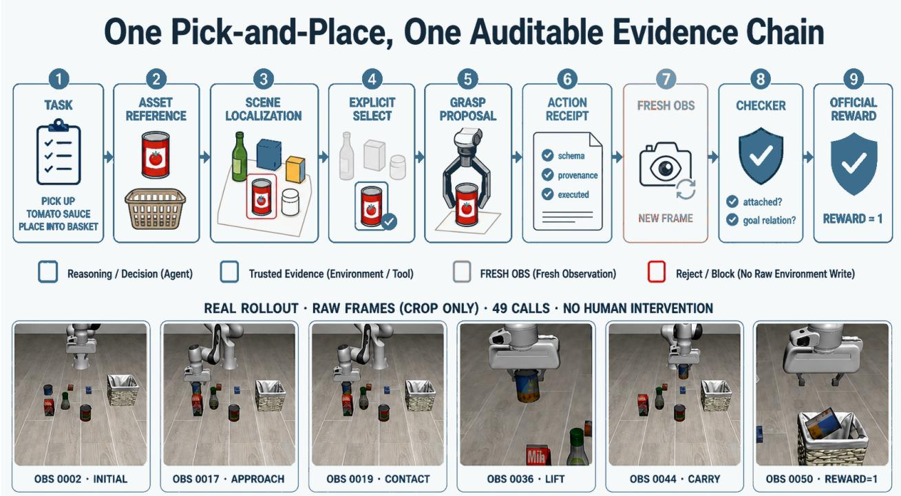  
Figure 8 An auditable pick-and-place evidence chain. Reasoning decisions, trusted environment evidence, and fresh post-action observations are stored separately; the frames show a recorded trajectory from initial observation to oficial reward.

## B Reproducible Experimental Protocol

This appendix defines the minimum reporting contract used by the experiments. It does not prescribe one machine or budget; it specifies what must be frozen and disclosed so that comparisons across models, experience versions, and backends remain auditable.

## B.1 Evaluation unit and success definition

An episode is the complete interaction in one initialized environment, from the first trusted observation to oficial success, environment termination, resource exhaustion, safety stop, or infrastructure failure. It must bind task ID and text, environment version, seed, treatment arm, model and prompt, Skill/strategy version, Tool-registry version, and resource budget.

Success requires a host-accepted trusted environment reward or equivalent oficial task verdict. Tool-call success, reach ing a pose, attachment PASS, or an Agent completion report are stage evidence only. For task i,

$$
S _ {i} ^ {@ k} = \max _ {1 \leq j \leq k} r _ {i, j}, \quad \text { Pass } @ k = \frac {1}{N} \sum_ {i = 1} ^ {N} S _ {i} ^ {@ k},\tag{4}
$$

where $r _ { i , j } \in \{ 0 , 1 \}$ is the oficial verdict for seed j. A Pass@k report must also state the total episode count.

We distinguish two episode-level designs. A fixed matrix evaluates the Cartesian product of all N tasks and a seed set S:

$$
\text { Success } _ {\text { fixed }} = \frac {\sum_ {i = 1} ^ {N} \sum_ {s \in \mathcal {S}} r _ {i , s}}{N | \mathcal {S} |}.\tag{5}
$$

A two-stage design first uses seed 0 to qualify a trusted frozen playbook, then runs preregistered held-out seeds only for qualified tasks; unqualified tasks remain zero in the full formal denominator. “Held-out” is valid only when the manifest proves those seeds did not contribute to strategy formation. Fixed-matrix success, two-stage episode success, and task-level Pass@k answer diferent questions and are not interchangeable.

## B.2 OpenETA for Codex setup

Since Libero’s fixed single third-person perspective is not convenient for synthesizing complete point clouds, we have added multiple camera views in Libero to synthesize high-quality point clouds. These are then used in Observe as three-view feedback to the agent, facilitating agent interaction.

The OpenETA for Codex comparison uses 512-by-512 images, live multi-view point selection, a 5,000-step simulator horizon, and a 5,400-second attempt timeout. For every planner, tasks receive ordered seeds 0–4 and stop after the first valid native-checker success. The task catalog, startup prompt, Tool and visual contracts, image configuration, and budgets are fixed across Luna, Terra, and Sol; each planner uses medium reasoning efort. Our main results— specifically, the success rates on 4‑suite + libero‑90—are shown in Table 8.

Table 8 OpenETA for Codex successes by Planner, suite, and Pass@k. GPT-5.6 Luna, Terra, and Sol use medium reasoning efort. Each cell counts tasks solved within the first k ordered seeds.

| Planner | Suite | Tasks | P@1 | P@2 | P@3 | P@4 | P@5 |
|---|---|---|---|---|---|---|---|
| Luna | Spatial | 10 | 4 | 7 | 8 | 9 | 9 |
| Object | 10 | 1 | 2 | 2 | 3 | 3 |  |
| Goal | 10 | 1 | 3 | 5 | 5 | 6 |  |
| Long / LIBERO-10 | 10 | 0 | 1 | 2 | 2 | 2 |  |
| LIBERO-90 | 90 | 15 | 28 | 36 | 41 | 42 |  |
| Total | 130 | 21 | 41 | 53 | 60 | 62 |  |
| Terra | Spatial | 10 | 8 | 8 | 8 | 10 | 10 |
| Object | 10 | 1 | 2 | 4 | 4 | 6 |  |
| Goal | 10 | 6 | 6 | 6 | 6 | 6 |  |
| Long / LIBERO-10 | 10 | 2 | 2 | 3 | 3 | 3 |  |
| LIBERO-90 | 90 | 41 | 43 | 50 | 57 | 58 |  |
| Total | 130 | 58 | 61 | 71 | 80 | 83 |  |
| Sol | Spatial | 10 | 10 | 10 | 10 | 10 | 10 |
| Object | 10 | 8 | 9 | 10 | 10 | 10 |  |
| Goal | 10 | 8 | 8 | 8 | 8 | 8 |  |
| Long / LIBERO-10 | 10 | 7 | 8 | 10 | 10 | 10 |  |
| LIBERO-90 | 90 | 59 | 69 | 75 | 76 | 79 |  |
| Total | 130 | 92 | 104 | 113 | 114 | 117 |  |

## B.3 Frozen manifest fields

Table 9 Minimum fields frozen for a formal experimental batch.

| Category | Required fields |
|---|---|
| Code and runtime | Release commit, dirty-diff hash, Python/dependency versions, operating system, compute device, and simulator/robot backend version. |
| Model and planner | Provider, model ID, inference parameters, system-prompt and planner hashes, plus request window if the hosted model is mutable. |
| Capability configuration | Tool registry and visible contracts, Skill/strategy hash, perception, grasp, and placement model versions, and calibration/scene versions. |
| Task and randomness | Benchmark version, suite, task ID and normalized text, seed, reconstructible initial-state reference, and attempt index. |
| Resource budget | Maximum planner turns, Tool calls, wall time, token or monetary budget, and timeout thresholds; paired arms use equal budgets. |
| Treatment | The sole allowed difference between arms, such as an exact-task playbook hash; manifest comparison verifies every other frozen field. |
| Outputs and evidence | Official reward, terminal reason, stages, violations, failure class, resources, and content hash or stable index for the rollout bundle. |

The self-evolution studies predate this release-level contract. Their source manifests establish task, seed, common budget, oficial reward, and treatment, but do not uniformly freeze the primary planner ID, system-prompt hash, or Skill-bundle hash. This does not alter recorded rewards or paired counts, but limits model attribution and third-party reproduction.

## B.4 Batch validity and exclusion

An episode is infrastructure-invalid if environment creation fails, task or seed identity mismatches, a required service is unavailable, treatment is not loaded, records/receipts are missing, or a frozen field drifts. Such an episode is not evidence of task incapability. Exclusion rules and the primary denominator must be fixed before seeing results. If the preregistered primary metric includes all launched matrix cells, later contamination remains in the raw denominator and a contamination-excluded value is reported only as a diagnostic. If one arm of a pair may be afected, the whole pair is invalid.

Exhausting time, calls, tokens, or allowed recoveries in a valid environment is a system failure under the stated budget, not infrastructure invalidity. Reports separately count valid and invalid episodes, successes, resource exhaustion, safety stops, and other task failures.

## B.5 Paired comparison and uncertainty

Experience, Skill, and strategy comparisons use the same task, seed, initial condition, model, Tools, prompt, budget, and backend; only treatment changes. Binary rates report their numerator and denominator. Paired outcomes include baseline-only, candidate-only, both-success, and both-fail, with an exact McNemar test when sample size permits. Stage reachability, turns, Tool calls, tokens, time, and invariant violations remain diagnostics and never replace the preregistered primary metric.

## B.6 Replayable evidence bundle

Each release-grade episode has a manifest plus append-only model-call, Tool-call, transition, episode-summary, and artifact-index records. Large images, point clouds, and videos use content-addressed references. Before release, credentials, tokens, user paths, device identifiers, and unnecessary provider payloads are removed while preserving fields needed to audit reward and failure classification.

## B.7 Automated audit and import gates

The two-stage importer scripts/import\_libero\_task\_eval.py accepts only a completed openeta.libero\_ task\_eval.v1 batch with run\_manifest.json, task\_catalog.json, summary.json, and COMPLETED.json. It verifies receipt hashes, four fixed suites with ten tasks each, task text and environment IDs, held-out seeds, arithmetic, cleanup, and infrastructure health. It also freezes planner/provider identity, timeouts, retry limits, Tool and task-catalog fingerprints, SAM3 and grasp backend contracts, object-reference bundles, and the MolmoPoint model revision when configured. Service URLs, local paths, sessions, and handles are omitted from the public snapshot.

The fixed-matrix importer scripts/import\_libero\_fixed\_matrix\_eval.py separately audits the full four-suite, ten-task, seed-0–9 Cartesian product. It validates per-session records, batch outcomes, and machine audit summary; checks task identity, read-only/no-evolution mode, budgets, planner and prompt hashes, and resources; and accepts success only from an oficial binary reward in a trusted receipt. An initialized trajectory that safely stops before any reward-bearing action remains a zero in the fixed denominator. Unattended help requests also remain zero; any actual human guidance or agent assistance rejects the batch.

Audit occurs in two stages. First, every record is traversed to construct an independent completion receipt containing manifest, preflight, provenance, session index, outcome, audit summary, and episode hashes. Second, hashes are re computed before producing the sanitized snapshot, main table and plot, success/failure resource diagnostics, mutually exclusive terminal distribution, deterministic representative failures, per-task tables, and reproducibility settings.

The frozen batch contains 397 complete session results and three cells with initialization evidence only. These are accepted only because both batch outcomes and the machine audit identify simulator unknown-handle expiration with matching task, seed, budget, and no assistance. They count as zero in the preregistered 400-episode primary denominator and as infrastructure contamination; resources cover only 397 complete records. The 56/397 contamination-excluded value is diagnostic only and cannot replace the primary metric. The freeze\_libero\_fixed\_report.py staging workflow regenerates the snapshot and eight LAT X products, updates manifests and rollout indices, rebuilds the content index, and runs the publication audit before writing back.

## B.8 Reproducibility Settings for the Frozen LIBERO Batch

Displayed hashes are 12-character prefixes. Full SHA-256 values, source-file hashes, per-task identity, and per-episode resources remain in the same sanitized audit snapshot. The table excludes service addresses, local paths, session handles, and credentials.

Table 10 Frozen reproducibility settings for the formal LIBERO matrix.

| Item | Frozen value |
|---|---|
| Batch and code | libero-fixed-40x10-20260730-r1; commit 4481a9ffd3b2... |
| Evaluation design | 40 tasks × 10 seeds = 400 episodes, full Cartesian product; read-only, no human intervention, no online self-evolution. |
| Integrity boundary | 3 infrastructure-contaminated cells; descriptively complete but not strictly infrastructure-clean. |
| Planner | AI Gateway / gpt-5.6-luna; medium reasoning effort; prompt e3cea22d277e... |
| Simulation contract | Tool contract 30e90334351e...; task catalog ee93dc8d3bb2... |
| Perception contracts | anygrasp=ff0fd3f032f3...; anyplace=b9afd7f7ce8e...; contact_graspnet=0fa6e5bf80d8...; depth_prior=26e9a311718d...; graspgenx=55ce2fb4f63c...; molmopoint=6e67aec902b5...; sam3=61b459c61c35...; MolmoPoint capability probe true. |
| Object memory | 3 frozen references; bundle 0dd76cf8b8d1... |
| Strategy and experience | fixed_read_only_no_self_evolution; Skill tree a5bc791b12f6...; grasp strategy 84607b1318a7...; task playbook b89bba287747...; calibration a46ed83b67ba... |
| Concurrency and cleanup | trace peak 10/10; provider peak 2/2; queue timeouts 0; active environments after cleanup 0. |

Table 11 Preregistered episode budgets by LIBERO suite.

| Suite | Max turns | Max calls | Timeout (s) | Max tokens |
|---|---|---|---|---|
| Spatial | 100 | 400 | 1800 | 10000000 |
| Object | 100 | 400 | 1800 | 10000000 |
| Goal | 100 | 400 | 1800 | 10000000 |
| Long / LIBERO-10 | 200 | 400 | 3600 | 10000000 |

These are stopping, not exclusion, rules: a valid episode that exhausts any budget remains a task failure.

The real-robot importer scripts/import\_real\_robot\_eval.py applies a parallel gate to manifests, trials, summaries, and completion receipts. It freezes clean code and interface-contract hashes, sanitized hardware configuration, calibration error and valid range, emergency-stop and workspace evidence, supervision, preregistered success/exclusion rules, planner identity, and budgets. Valid trials reference continuous video, structured rollout, and verdict evidence. Physical intervention and safety stops remain autonomous failures. A claim can rise from interface integration to prim itive or task validation only when both the code commit and interface contract match the release snapshot.

## B.9 Claim–evidence matrix and public artifact index

publication\_manifest.json records claim status and evidence paths. results/report\_artifact\_index.json deterministically records each referenced file’s SHA-256, size, and claim membership. Any content or path change invalidates the old index. The separate results/sanitized\_rollout\_index.json maps stable run/task/trial IDs to public or restricted trace, video, receipt, or verdict hashes. Restricted records state why; public records require HTTPS locations. Raw self-evolution rollouts remain restricted, formal LIBERO has forty content-addressed task bundles, and formal real-robot results remain pending.

The final archive is built from an allowlist by scripts/build\_publication\_bundle.py, not by recursively copying the repository. It includes the PDF, LATEX source and figures, build/audit tools, manifests, indices, and named sanitized results. Its BUNDLE\_MANIFEST.json fixes file hashes, sizes, archive paths, timestamps, permissions, order, and com pression. Draft bundles retain explicit provisional warnings; a release bundle requires the PDF, log, content index, and all release gates to pass.

Table 12 Primary claims, minimum evidence, and interpretation limits.

| Claim | Minimum supporting evidence | What it does not establish |
|---|---|---|
| Release implementation and 44 Tools | System-contract snapshot, source, and dependency hashes from a clean release commit. | Installed dependencies on the evaluation host or any task success. |
| Formal LIBERO capability | Completion receipt, frozen catalog, complete protocol denominator, sanitized snapshot, and deterministically generated tables. | Exploration, qualification success, and development traces cannot fill the formal denominator. |
| Self-evolution mechanism | Frozen snapshots, task and manifest hashes, paired outcomes, stage evidence, and promotion verdicts from six audited batches. | Zero promotions prove neither mechanism effectiveness nor universal failure of textual experience. |
| Real-robot interface integration | Interface, driver registration, gates, and configuration hashes from a clean release commit. | SDK/device availability, calibration, primitive success, or task success. |
| Real-robot primitive or task capability | Completed preregistered batch, continuous video and roll-out hashes, verdict evidence, interventions, stops, and invalid trials. | Simulation, source presence, or edited success clips cannot raise the physical claim level. |
| Public evidence bundle | Publication manifest, content-addressed artifact index, sanitized results, generated tables, and audit scripts. | A path alone does not prove content stability; a hash does not imply raw traces are public. |

## C Per-Task Results and Reporting Format

An aggregate rate cannot show which tasks are stable, which depend on a particular seed, or whether failures occur during perception, grasp, attachment, or placement. Every formal benchmark batch should therefore publish machinereadable per-task results and generate paper tables from the same frozen source.

Table 13 Minimum columns for per-task results.

| Field | Meaning |
|---|---|
| suite / task ID / task text | Stable benchmark identity with complete normalized task text. |
| seeds and attempts | Executed seeds, attempt order, and preregistration membership. |
| metric / denominator | Task-level Pass@k, fixed-matrix episode success, or two-stage held-out episode success, with binary verdicts and task/episode denominators. |
| terminal reason | Official success, environment termination, resource exhaustion, safety stop, task failure, or infrastructure invalidity. |
| furthest verified stage | Last evidenced stage, such as localization, attachment, placement estimate, release, or official reward. |
| cost | Turns, Tool calls, model tokens, wall time, timeouts, and optional cost. |
| violations | Unresolved observation/selection obligations, premature release, illegal numeric experience, and other contract violations. |
| evidence index | Stable ID and content hash for rollout bundles, key frames, or video. |

Table 2 reports suite aggregates. The four generated tables below list, for all 40 tasks, the number of successes over 10 seeds, mutually exclusive terminal summary, mean resources, and content-addressed evidence ID. All values and macros derive from one sanitized audit snapshot; development traces and obsolete placeholders never enter the denominator.

For this fixed matrix, three simulator-TTL-contaminated cells lack complete session results. Batch outcomes and the machine audit jointly fix their identity, and they remain in each task’s ten-seed denominator. Per-task resource means use only complete episode records. The importer cannot rename episode success as Pass@k, and the publication gate re-renders every formal value from the snapshot.

## C.1 Per-Task Fixed-Matrix Results

These tables are generated from completed batch libero-fixed-40x10-20260730-r1 after receipt and episodecontent-hash verification. Every task runs seeds 0–9 once. The metric is fixed-matrix episode success, not task-level @k, and uses no qualification filter. 3 cells are infrastructure contaminated. They remain zeros in the preregistered 400-episode denominator but are omitted from per-episode means for turns, Tool calls, and tokens.

Table 14 Spatial.

| Task | Success | Rate | Resource n | Mean T/C | Primary failure |
|---|---|---|---|---|---|
| 0 | 3/10 | 30.0% | 10/10 | 37.7/37.3 | episode_timeout |
| 1 | 0/10 | 0.0% | 10/10 | 55.1/54.9 | episode_timeout |
| 2 | 1/10 | 10.0% | 10/10 | 27.0/27.0 | episode_timeout |
| 3 | 1/10 | 10.0% | 10/10 | 42.4/42.2 | episode_timeout |
| 4 | 2/10 | 20.0% | 10/10 | 41.4/41.2 | episode_timeout |
| 5 | 0/10 | 0.0% | 10/10 | 55.3/55.1 | episode_timeout |
| 6 | 0/10 | 0.0% | 10/10 | 42.2/41.9 | episode_timeout |
| 7 | 0/10 | 0.0% | 10/10 | 65.0/64.9 | episode_timeout |
| 8 | 0/10 | 0.0% | 10/10 | 50.9/50.5 | episode_timeout |
| 9 | 1/10 | 10.0% | 10/10 | 57.9/57.8 | episode_timeout |

Table 15 Object.

| Task | Success | Rate | Resource n | Mean T/C | Primary failure |
|---|---|---|---|---|---|
| 0 | 0/10 | 0.0% | 10/10 | 31.7/31.3 | episode_timeout |
| 1 | 7/10 | 70.0% | 10/10 | 36.1/36.1 | episode_timeout |
| 2 | 2/10 | 20.0% | 10/10 | 20.6/20.3 | episode_timeout |
| 3 | 2/10 | 20.0% | 10/10 | 40.2/40.1 | episode_timeout |
| 4 | 4/10 | 40.0% | 10/10 | 42.0/41.8 | episode_timeout |
| 5 | 4/10 | 40.0% | 10/10 | 41.9/41.8 | episode_timeout |
| 6 | 3/10 | 30.0% | 10/10 | 36.1/36.0 | episode_timeout |
| 7 | 1/10 | 10.0% | 10/10 | 33.3/33.2 | episode_timeout |
| 8 | 0/10 | 0.0% | 10/10 | 7.2/7.1 | episode_timeout |
| 9 | 3/10 | 30.0% | 10/10 | 23.4/23.2 | episode_timeout |

Table 16 Goal.

| Task | Success | Rate | Resource n | Mean T/C | Primary failure |
|---|---|---|---|---|---|
| 0 | 0/10 | 0.0% | 10/10 | 19.2/18.8 | episode_timeout |
| 1 | 5/10 | 50.0% | 10/10 | 61.9/61.9 | max_turns |
| 2 | 0/10 | 0.0% | 10/10 | 47.8/47.7 | episode_timeout |
| 3 | 0/10 | 0.0% | 10/10 | 37.9/37.7 | episode_timeout |
| 4 | 9/10 | 90.0% | 10/10 | 34.4/34.4 | episode_timeout |
| 5 | 0/10 | 0.0% | 10/10 | 57.1/57.1 | episode_timeout |
| 6 | 5/10 | 50.0% | 10/10 | 34.9/34.6 | status_report_without_reward |
| 7 | 0/10 | 0.0% | 10/10 | 7.2/7.2 | episode_timeout |
| 8 | 2/10 | 20.0% | 10/10 | 50.6/50.2 | episode_timeout |
| 9 | 0/10 | 0.0% | 10/10 | 16.8/16.3 | episode_timeout |

Evidence ID libero-fixed-40x10-20260730-r1:<suite>:task-<index> links complete task text, trusted perseed verdicts, resources, and source-record hashes to the release rollout index.

Tables 22 and 23 provide per-task evidence for the self-evolution comparisons. They preserve an important reporting property: equal oficial reward does not erase diferences in stage reachability or resources, although those diagnostics do not establish capability equality or improvement.

## C.2 Qualitative local success rollouts

The trajectory plates below demonstrate the report’s visual trace format: post-Tool observations, stage labels, Tool names, and the final trusted environment reward remain visible in one artifact. They are local success rollouts prepared for qualitative inspection. They are not indexed cells of the frozen 400-episode matrix, are not used to recompute any table, and must not be interpreted as additional benchmark successes. Figures 9, 10, and 11 instantiate this format for an Object-suite task, a Goal-suite task, and a reward-reproduction diagnostic, respectively.

Table 17 Long / LIBERO-10.

| Task | Success | Rate | Resource n | Mean T/C | Primary failure |
|---|---|---|---|---|---|
| 0 | 0/10 | 0.0% | 10/10 | 101.7/101.3 | max_turns |
| 1 | 0/10 | 0.0% | 10/10 | 22.3/22.0 | episode_timeout |
| 2 | 0/10 | 0.0% | 10/10 | 30.5/29.8 | unattended_ask_human |
| 3 | 0/10 | 0.0% | 10/10 | 49.1/48.7 | episode_timeout |
| 4 | 0/10 | 0.0% | 10/10 | 83.6/83.6 | episode_timeout |
| 5 | 0/10 | 0.0% | 10/10 | 78.3/78.0 | episode_timeout |
| 6 | 0/10 | 0.0% | 9/10 | 75.7/75.6 | episode_timeout |
| 7 | 1/10 | 10.0% | 10/10 | 105.3/105.2 | episode_timeout |
| 8 | 0/10 | 0.0% | 8/10 | 14.4/14.2 | episode_timeout |
| 9 | 0/10 | 0.0% | 10/10 | 17.5/16.5 | unattended_ask_human |

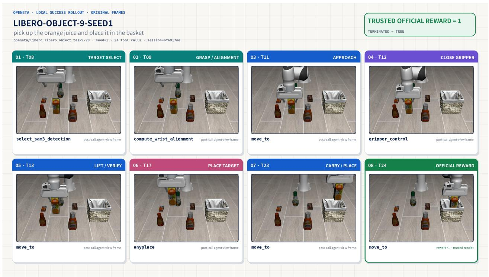  
Figure 9 Qualitative local Object-suite rollout. The plate shows target selection, wrist alignment, approach, grasp, placement, and trusted reward as individually inspectable stages. It is excluded from the formal fixed-matrix denominator.

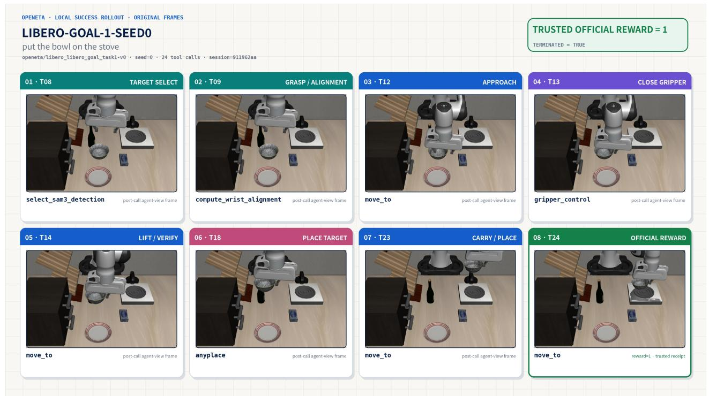  
Figure 10 Qualitative local Goal-suite rollout. Fresh post-call frames make the grasp, lift, transport, placement, and oficial reward transitions visible. It is excluded from the formal fixed-matrix denominator.

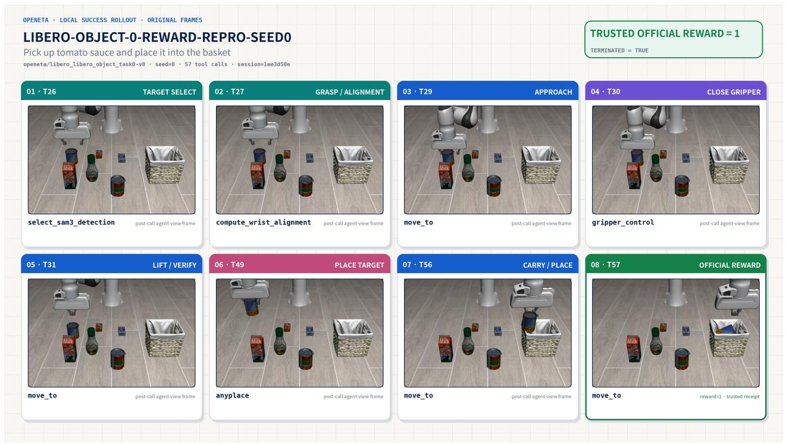  
Figure 11 Qualitative local reward-reproduction rollout. This diagnostic plate visualizes a locally reproduced oficial reward and is not the frozen result for the similarly numbered Object-suite task. It is excluded from every formal aggregate and task-level metric.

## D Failure Taxonomy and Evidence Standard

OpenETA distinguishes call completion, physical action completion, and task completion. A successful move\_to says that the backend completed one atomic motion; attachment PASS says that current evidence supports continued carriage; only trusted environment reward establishes task completion.

Table 18 Recommended mutually exclusive primary episode failures.

| Class | Decision boundary | Minimum evidence |
|---|---|---|
| infrastructure_invalid | Environment, service, configuration, or logging prevents fair evaluation | Startup/health evidence, exception, and frozen-field drift; retain or exclude only under the preregistered denominator rule. |
| target_localization_exhausted | Target identity remains unconfirmed after allowed retrieval, localization, and segmentation | Latest observation, candidates/masks, and rejection reasons. |
| grasp_proposal_or_safety | No grasp candidate exists or all candidates fail geometry/safety gates | Candidate provenance, scores, frame transforms, and gate diagnostics. |
| precontact_or_contact_motion | Hover, approach, contact, close, or lift motion fails | Pre/post observations, action receipt, and controller diagnostics. |
| attachment_fail_or_unknown | Evidence shows the grasp failed or cannot confirm attachment | Probe type, threshold/diagnostic, and fresh observation; unknown is never PASS. |
| placement_estimation | No executable placement relation or pose is generated and verified | Receptacle selection, candidates, frames, and safety checks. |
| premature_release_or_invariant | Gripper opens before release prerequisites, or another obligation is violated | Obligation state and ordered accepted/blocked commands. |
| post_release_no_reward | Release and observation refresh complete without official success | Release receipt, fresh observation, and trusted environment receipt. |
| resource_exhausted | A valid run consumes its turns, calls, tokens, or wall-time budget | Terminal counters and unfinished stage. |
| need_human_or_safe_stop | Ambiguity or risk exceeds the autonomous boundary | Risk rationale, final safe state, and unresolved obligations. |

## D.1 Minimum evidence chain for a case study

A failure case should not be a single aftermath image. In temporal order it should show: (1) task and initial observation; (2) target/candidate selection; (3) last verified stage; (4) the decisive action, fresh post-action observation, and trusted receipt; and (5) stop reason, remaining budget, and unresolved obligations. Media are labeled with episode ID, time step, and camera, while content hashes link the paper’s key frames to the full bundle.

The primary class is mechanically selected from terminal evidence under a fixed priority, one per episode. Secondary labels such as timeout, segmentation\_ambiguous, or attachment\_regression may coexist. This preserves an additive distribution without discarding cross-stage symptoms. Insuficient evidence is unknown, not an inferred root cause.

## D.2 Representative Terminal Cases from the Formal LIBERO Batch

Each row is selected mechanically rather than curated as a “typical story.” For every mutually exclusive terminal class, we choose the first failed episode ordered by preregistered suite, task index, and seed. Classes appear in decreasing batch frequency; Table 4 gives complete counts.

Table 19 Deterministic representative episode for each terminal class. Resources are turns / Tool calls / wall-clock seconds.

| Terminal class | n | Suite | Task/seed | Resources | Evidence ID |
|---|---|---|---|---|---|
| episode_timeout | 215 | Spatial | 0/1 | 43/43/1801.5 | libero-fixed-40x10-20260730-r1: libero_spatial:task-00:seed-1 |
| unattended_ask_human | 66 | Spatial | 0/6 | 21/20/1382.1 | libero-fixed-40x10-20260730-r1: libero_spatial:task-00:seed-6 |
| max_turns | 35 | Spatial | 1/4 | 100/100/554.6 | libero-fixed-40x10-20260730-r1: libero_spatial:task-01:seed-4 |
| status_report_without_reward | 24 | Spatial | 0/0 | 33/32/1224.8 | libero-fixed-40x10-20260730-r1: libero_spatial:task-00:seed-0 |
| simulator_unknown_handle | 3 | Long/LIBERO-10 | 6/6 | -/-/1909.1 | libero-fixed-40x10-20260730-r1: libero 10:task-06:seed-6 |
| remote_episode_terminated_without_reward | 1 | Long / LIBERO-10 | 0/2 | 75/75/2735.7 | libero-fixed-40x10-20260730-r1:libero_10:task-00:seed-2 |

An Evidence ID identifies a task bundle and seed in the release rollout index; raw session IDs, local paths, service addresses, and trajectory payloads do not enter the paper. A terminal label says where execution stopped, not the unique physical or planning root cause. Infrastructure rows show “–” for turns and Tool calls because their batch outcomes lack complete resource fields. Root-cause claims still require pre/post observations, trusted receipts, and stage diagnostics.

## D.3 Representative cases from frozen comparisons

Table 20 uses a preregistered deterministic rule: select the lexicographically first task and seed among all baseline-only exact-task-playbook pairs. Both arms use task 1 and seed 3 in read-only mode; only the candidate loads the exact-scope playbook.

Table 20 Representative baseline-only exact-task-playbook pair. Values come from the frozen snapshot; success means trusted reward only.

| Ordered evidence | Baseline | Candidate |
|---|---|---|
| 1. Frozen condition | task 1, seed 3; no playbook | task 1, seed 3; exact-scope playbook loaded |
| 2. Trusted verdict | official success = 1 | official success = 0 |
| 3. Terminal state | environment completion (environment) | episode wall-time exhaustion (episode_timeout) |
| 4. Resources | 26 turns, 26 calls, 1093.8 s | 51 turns, 51 calls, 1801.0 s |
| 5. Mechanical verdict | successful control arm | resource_exhausted; pair is baseline_only; reject promotion |

This pair establishes that, under frozen conditions, the candidate fails to reproduce baseline reward and consumes more resources, so the promotion gate must reject it. It does not prove that one playbook sentence is the unique physical cause of timeout; that would require rule-trigger instrumentation or a finer intervention.

The second case is the only valid contrastive-v2 replay. It separates the common stage prefix, release obligation, oficial reward, and terminal state.

Table 21 Invariant case for a contrastive stage-local strategy. Neither arm receives reward; the candidate adds one premature gripper-open violation.

| Ordered evidence | Baseline | Candidate |
|---|---|---|
| 1. Frozen condition | task 2, seed 0; candidate hidden | task 2, seed 0; reviewed candidate visible |
| 2. Shared prefix | segmentation → grasp estimation → contact → attachmentPASS → placement estimate | same as baseline |
| 3. Release and reward | no valid placement release; official success = 0 | no valid placement release; official success = 0 |
| 4. Invariant evidence | 0 violations | 1 open_before_attachment_failure_or_placement_release |
| 5. Terminal/resources | episode_timeout; 42 turns / 42 calls / 1801.1 s | status_report; 34 turns / 33 calls / 980.2 s |
| 6. Mechanical verdict | resource_exhausted | premature_release_or_invariant; replay fails, held-out not scheduled, promotion rejected |

The valid pair has 0 infrastructure exclusions, so it is eligible for task-level diagnosis. Operator interruption, provider exhaustion, or shared-environment failure would instead invalidate the entire pair. The evidence is suficient to reject a candidate that adds a violation without success; it does not establish that the violation uniquely caused the absent reward.

## E Supplementary Self-Evolution Results

This appendix expands the paired studies in Section 6. Success always means trusted oficial reward; stage counts are diagnostic. A candidate that fails replay never enters held-out evaluation, and an infrastructure-invalid pair is excluded.

## E.1 Task-local Skill/strategy

Equal final reward does not mean no treatment efect: baseline/candidate arms record 5/1 attachment passes and 3/0 Any-Place reaches. These exploratory stage metrics have no preregistered inference test, so they support only “no observed success gain” and preserve reduced upstream reachability as a diagnostic, not a statistically significant degradation.

## E.2 Exact-task playbook

Baseline success is $4 / 3 0 = 1 3 . 3 \%$ . Playbook success is $1 / 3 0 = 3 . 3 \%$ . Among 30 pairs, baseline-only = 4, playbookonly = 1, both-success = 0, and both-fail = 25. The exact two-sided McNemar $p = 0 . 3 7 5$ is insuficient for a significant degradation, but the candidate fails the required “objective gain without regression” gate.

Table 22 Per-task task-local results on 10 held-out seeds.

| Spatial task | Official success | Attachment PASS | Reached AnyPlace |  |  |  |
|---|---|---|---|---|---|---|
| Base | Cand. | Base | Cand. | Base | Cand. |  |
| Task 1 | 0/10 | 0/10 | 2 | 0 | 1 | 0 |
| Task 2 | 0/10 | 0/10 | 3 | 1 | 2 | 0 |
| Task 4 | 0/10 | 0/10 | 0 | 0 | 0 | 0 |
| Total | 0/30 | 0/30 | 5 | 1 | 3 | 0 |

Table 23 Per-task held-out pairs for the exact-task playbook.

| Spatial task | Seeds | Baseline success | Playbook success |
|---|---|---|---|
| Task 1 | 10 | 2 | 0 |
| Task 2 | 10 | 2 | 1 |
| Task 4 | 10 | 0 | 0 |
| Total | 30 | 4 | 1 |

Table 24 Stage reachability and resource diagnostics for the exact-task playbook.

| Metric (each arm: 30 episodes) | Baseline | Playbook |
|---|---|---|
| Reached grasp estimate | 30 | 30 |
| Reached move | 27 | 24 |
| Reached close | 21 | 15 |
| Reached attachment assess | 16 | 5 |
| Attachment PASS | 14 | 5 |
| Reached AnyPlace | 12 | 4 |
| Reached release | 15 | 10 |
| Official reward | 4 | 1 |
| Mean Tool calls | 42.6 | 49.2 |
| Mean planner turns | 42.8 | 49.3 |
| Mean wall time (s) | 1546.2 | 1678.2 |
| Timeout episodes | 18 | 23 |

Both versions produce a grasp estimate in every episode. They difer at later stages. The baseline/playbook reach attachment assessment 16/5 times, pass the attachment check 14/5 times, and reach AnyPlace 12/4 times. The playbook also uses more turns and Tool calls and has more timeouts. These counts show where the behaviors separate. They are not transition probabilities, because a recovery path can skip a logged stage.

## E.3 Stage-local task-strategy

A second Task-1 diagnostic pair in v2 fails batch-validity conditions and is excluded. Experimental validity determines whether a comparison is interpretable; the capability gate then decides whether a valid candidate deserves promotion. All candidates remain isolated and none became a shared capability.

## E.4 Validity boundaries

• Adaptive sequence. Later representations and gates follow earlier diagnoses; the five studies are not independent replications under one preregistration. The McNemar value describes only the exact-task comparison.

• Coverage. Formal pairs concentrate on LIBERO Spatial Tasks 1/2/4, with still smaller stage-local replay. Results do not generalize to all LIBERO, LIBERO-Pro, or real robots.

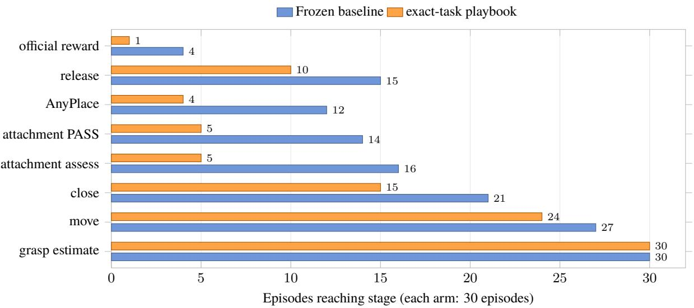  
Figure 12 Stage reach for the exact-task playbook. Each arm contains 30 paired episodes. The chart shows where the baseline and playbook begin to difer. Stage events are not a strictly nested funnel because recovery paths can skip events.

Table 25 Replay-gate results for stage-local task-strategy candidates.

| Version | Valid comparison | Resources/outcome | Gate verdict |
|---|---|---|---|
| v1 | Tasks 1/2/4, seed 0, 3 pairs | Both arms 0/3; baseline/candidate mean turns 43.3/46.7, mean time 1342.3/1634.9 s | Reward not reproduced and candidate slower; held-out not scheduled. |
| v2 | Task 2, seed 0, 1 valid pair | Both arms 0/1; baseline 42 turns / 42 calls / 777316 tokens / 1801.1 s; candidate 34 / 33 / 973525 / 980.2 s | No change to the key failure and 1 new premature-open violation; reject. |

• Residual randomness. Matched task, seed, and budget control initial environment state, but remote model sampling, perception, and contact remain stochastic. Zero success in a small sample does not establish equivalence.

• Treatment integrity. Loading experience does not prove that a key rule triggered or was followed. V2 records adherence and violations; earlier studies infer them from Tool sequences and events.

• Selection and credit. A playbook from one success may encode incidental perception or contact. Non-nested stage events localize divergence but do not prove causality.

The strongest supported statement is that no candidate satisfies the declared promotion criteria, not that textual experience can never improve a physical task. A confirmatory study should freeze tasks, seeds, primary metric, treatmentintegrity checks, and thresholds before candidate generation, then evaluate once on seeds excluded from candidate formation.

## E.5 Frozen settings and identity limits

Table 26 Common settings auditable from self-evolution manifests.

| Setting | Frozen value | Evidence boundary |
|---|---|---|
| Benchmark | LIBERO Spatial | Every episode binds task index, seed, and normalized task-text SHA-256. |
| Common budget | At most 100 turns, 400 Tool calls, 10000000 tokens, and 1800 s | Every manifest entry in the six source batches carries these values. |
| Success and task identity | Official environment reward; simulator-assigned task | Both conditions are required per episode; stages do not replace success. |
| Paired evaluation | Same task, seed, and budget | Task-local, playbook, v1, and v2 are read-only pairs; online rounds are adaptive exploration. |
| Primary planner identity | not frozen in run manifests | Provider/model is absent from historical run manifests, preventing exact planner-version attribution. |
| V2 author/reviewer | AI Gateway / gpt-5.6-luna; two isolated contexts | 2 candidates accepted. Author and reviewer both use gpt-5.6-luna; this is context isolation, not cross-model review. |

## E.6 Evidence index

Table 27 Stable experiment identifiers for quantitative claims.

| Experiment ID | Evidence |
|---|---|
| spatial-adaptive-3round-20260728-r1 | First three-round online study: 0→1→0. |
| spatial-adaptive-3round-20260729-r2 | Second three-round online study: 0→0→3. |
| spatial-self-evolution-ab-20260729-r1 | Task-local paired outcomes and stages. |
| spatial-playbook-ab-20260729-r1 | 30 exact-task held-out pairs. |
| spatial-task-strategy-replay-20260729-r3 | Valid seed-0 stage-local v1 replay. |
| spatial-contrastive-strategy-v2-20260729-r3 | Valid Task-2 contrastive-v2 replay; invalid batch excluded. |

These IDs point to frozen summaries and rollout manifests, not local absolute paths. The sanitized machine-readable snapshot is results/self\_evolution\_summary.json. The freezing script verifies code commit, dirty-dif hash, summary/analysis/gate hashes, batch validity, cleanup, and promotion verdict, then deterministically generates both the snapshot and sections/generated/self\_evolution\_result\_values.tex. The publication gate compares every macro and generated byte. With the six source directories, makeverify-self-evolution-sourceOPENETA\_ MEMORY=<memory-root> rebuilds the source-to-snapshot-to-paper chain without overwriting repository files.

## F Core Execution and Trajectory Protocol

This appendix fixes the minimum protocol surface used by the paper. Tool parameters may evolve, but no version may bypass the command types, trusted receipts, or post-action observation invariant below. A release manifest states the implemented schema versions and hashes.

## F.1 Commands and normalized results

Table 28 Stable top-level contract between planner and host.

| Object | Stable semantics |
|---|---|
| AgentCommand | Schema openeta.agent_command.v1; top-level kind is tool_call or response. A Tool call names a host-registered Tool with structured arguments; a response has no physical side effect. |
| ToolResult | Schema openeta.tool_result.v1; common fields include tool, category, effect, result_type, and success. Payload fields separately store parameters, outputs, artifacts, state_delta, diagnostics, and requires_observation_after_call. |
| Tool binding | The host owns Tool names, parameter schemas, handlers, backends, and side effects. A Skill or model output can select registered capabilities but cannot masquerade as a new atomic action. |

## F.2 Trusted environment receipts

Oficial reward and termination require a host-attested openeta.environment\_receipt.v1. Runtime validation matches authority, execution ID, session ID, and environment handle to the current call. Ordinary Tool output or model text cannot mint oficial reward. Timeout means that a side efect may have occurred; recovery queries backend state or observes again rather than blindly replaying the mutation.

## F.3 Runtime obligations

Table 29 Obligations that constrain physical execution.

| Obligation | Trigger | Discharge condition and blocked scope |
|---|---|---|
| Fresh observation | A world-changing result lacks a sufficiently fresh snapshot | Trusted observation must update state before another state-dependent physical decision; stop safely after three failed refreshes. |
| Target selection | Segmentation yields multiple candidates or identity is ambiguous | Record an explicit candidate and rationale; block grasp/contact until resolved. |
| Grasp candidate | The planner switches or rejects a grasp proposal | Retain provenance, transform, score, and checks so candidate changes remain traceable. |
| Release prerequisite | The object is believed attached and placement begins | Open the gripper only after placement relation, motion, and state evidence satisfy the contract; otherwise block and record a violation. |

## F.4 Session state and release trajectories

trace.jsonl stores audit events, conversation.jsonl supports history recovery, working/ stores mutable state, and rollout/ stores the immutable release bundle. Its manifest.json fixes configuration. Files model\_calls.jsonl, tool\_calls.jsonl, transitions.jsonl, episodes.jsonl, and artifacts.jsonl store calls, state changes, summaries, and content-addressed artifacts. Training and paper statistics consume validated rollout bundles, not console logs.

## F.5 Release-grade system-contract snapshot

scripts/freeze\_system\_contracts.py generates results/system\_contracts.json from a clean OpenETA release checkout. The snapshot freezes the Git commit; hashes of four critical source files; Tool names, categories, side efects, fresh-observation requirements, and parameter schemas; command, result, receipt, and rollout schema versions; root dependency files; seven perception/grasp requirement files; and the UniDepth deployment Dockerfile.

The freezer requires exactly 44 registered Tools and a clean checkout. Development branches can create preview snapshots, which cannot pass the publication gate. This report’s release snapshot comes from clean main@135a7edc7e60: 16 read-only, 12 planning, 9 bookkeeping, and 7 world-mutating Tools. Adding, removing, or reclassifying a Tool, or changing a schema, explicitly invalidates the paper check. Dependency hashes establish what the release source declares, not what was installed on the evaluation machine; each experimental manifest records the latter independently.

## G Sim2Real Disclosure and Safety Checklist

Interface presence, primitive-level hardware validation, and complete real-robot task success are distinct evidence levels. We use the terms interface integration, primitive validation, and task validation separately; simulation success raises none of them automatically.

## G.1 Frozen interface-level evidence

The current report is frozen at interface integration. The machine-readable results/real\_robot\_interface. json snapshot comes from clean release branch main@135a7edc7e60. It records six camera-driver keys, two armdriver keys, six lifecycle entry points, and five control entry points, and hashes adapter, registry, MCP, driver, calibra tion, configuration, and test source. Device IPs, serial numbers, and calibration matrices are not exported.

The snapshot verifies source paths for cross-process exclusion, handle/session ownership, reset-before-control, postaction observation, idempotent close, and per-command translation/rotation limits; out-of-bounds requests are rejected, not silently clipped. Fixed-base control remains an explicit stub. These are source contracts, not evidence of SDK installation, device reachability, current calibration, on-hardware primitive execution, collision safety, or autonomous task success.

## G.2 Real-robot execution status

Table 30 Current real-robot evidence status.

| Item | Status |
|---|---|
| Formal batch | Pending; no development value is promoted into the formal result macros. |
| Current citable level | Interface integration. |
| Retained demonstrations | One complete sponge-to-tray recording; one bell-pepper recording with grasp and transport visible but no supported final in-basket relation. Neither recording establishes a denominator or success rate. |
| Primitive/task results | No formal batch has passed completion-receipt, evidence-hash, intervention, and safety-stop audit. |
| Formal import products | Sanitized JSON, result macros, reproducibility/safety settings, per-target table, and per-trial evidence index. |

## G.3 Demonstration Setup, Observations, and Evidence Boundary

Development testing used a RealSense D435i for the wrist view and a supplementary third-person view, and a lidarequipped RealSense L515 for the main third-person view. Relative to simulator depth, missing and unreliable depth regions propagated through depth enhancement into pose estimation. The resulting target poses were often too lowquality for consistent grasping. Separately, lateral grasp commands sometimes triggered acceleration-limit protective stops. Controller PD parameters or trajectory shaping are plausible contributors, but controlled replay and controller telemetry are required before assigning cause.

The publication manifest cites a machine-readable record containing the two video hashes and their visual-verdict boundaries. It deliberately remains outside the formal result macros. Promotion requires a trial ledger with trial order, outcome, terminal reason, intervention and safety-stop fields; continuous video or trial-aligned clips; rollout and verdict hashes; the executed clean commit and interface-contract hash; calibration statistics; safety-limit and emergency-stop records; and a frozen protocol. Selected recordings may illustrate behavior, but they cannot establish a denominator or failure rate.

For public release, the project page should present the two videos as representative development demonstrations, link the evidence record, and expose content hashes. Selected frames may be used in the paper after the videos are frozen; each frame should identify its task and stage, and the caption must retain the qualitative-demonstration qualifier.

## G.4 Automated audit of a completed batch

A formal batch provides run\_manifest.json, trials.json, summary.json, and COMPLETED.json. The importer verifies the receipt and clean-code hashes. It also checks the interface contract, sanitized hardware and firmware summaries, calibration error, emergency-stop test, on-site supervision, preregistration, common budgets, and video/rollout/verdict evidence for every trial. Public snapshots exclude network addresses, serial numbers, local paths, handles, person names, and credentials.

Autonomous success requires a valid trial, oficial-success termination, no physical intervention, and no safety stop. Interventions and safety stops remain autonomous failures. Preregistered infrastructure-invalid trials are excluded from the rate denominator but retain invalidity evidence and counts. The importer derives target summaries, trial indices, and hardware, calibration, safety, protocol, planner, and budget settings from one audited snapshot.

## G.5 Minimum disclosure for a physical batch

Table 31 Minimum archived or public evidence for each real-robot batch.

| Item | Frozen information | Minimum evidence |
|---|---|---|
| Hardware/backend | Robot, gripper, camera, controller, firmware, and adapter versions | Device manifest, health checks, and backend hashes. |
| Frames/calibration | Base, end-effector, camera, and World frames; intrinsic/extrinsic profile | Calibration date, errors, validation points, and valid distance. |
| Timing | Timestamp sources and synchronization for image, depth, state, and receipt | Maximum staleness and observation-to-state alignment checks. |
| Depth/geometry | Units, invalid-value handling, enhancement, and valid domain | Raw/enhanced depth references, scale checks, and boundary cases. |
| Motion limits | Position, orientation, speed, acceleration, jerk, force/torque, and payload | Configuration plus tests showing out-of-range commands are blocked. |
| Collision/contact | Self/environment collision, approach/contact modes, and recovery | Preview/check output, low-speed contact tests, and failure stops. |
| Emergency stop/supervision | Hardware/software stop, operator position, takeover, and reset | Pre-batch stop test and supervision record. |
| Request semantics | Command ID, timeout, cancellation, retry, and idempotency | Post-timeout state query and no unaudited duplicate motion. |
| Post-action observation | Fresh snapshot return or explicit observation obligation | Time-aligned pre/post observations and discharge record. |
| Resource ownership | Exclusive lease, session isolation, and abnormal release | Concurrent-request rejection and crash-safe reclamation. |
| Task/evidence | Task, setup, trial, perturbation, budget, and success rule | Continuous video, structured rollout, official verdict, and failure class. |
| Promotion boundary | Canary Tool, composed flow, full task, and held-out scene order | Independent pass without new safety violation at each level. |

Every intervention is reported with its time. Risk-motivated takeover remains a safety event and cannot be edited into an autonomous success. Human-shared workspaces, unknown objects, and higher-speed studies require separate risk assessment. This checklist is a paper-disclosure minimum, not a substitute for manufacturer requirements, institutiona safety procedures, or on-site operator judgment.